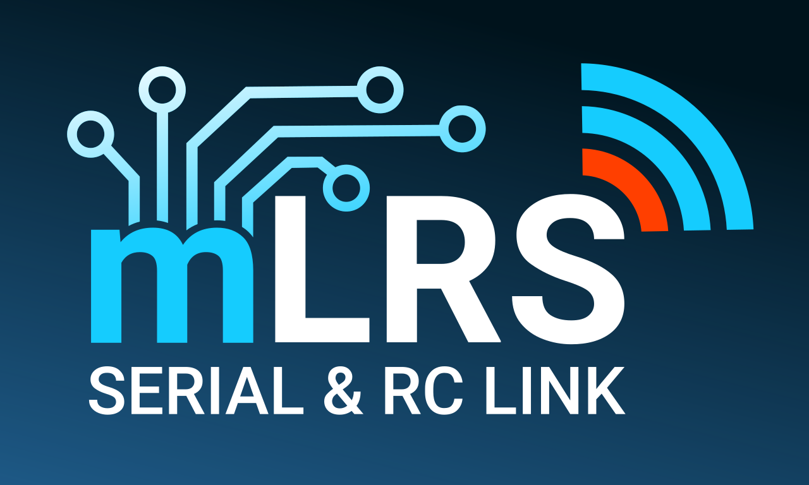

# mLRS Documentation #

Documentation for the [mLRS project](https://github.com/olliw42/mLRS).

## Content ##

### General ###
- [mLRS Overview](https://github.com/olliw42/mLRS/blob/main/README.md)
- [Quick Start Guide](docs/QUICK_START.md)
- [Binding](docs/BINDING.md)
- [Configuration Parameters](docs/PARAMETERS.md)
- [mLRS Lua Script](docs/LUA.md)
- [OLED Display](docs/OLED.md)
- [Configuration ID](docs/CONFIGID.md)
- [Flashing/Upgrading Firmware](docs/FLASHING.md)
- [Logging](docs/LOGGING.md)
- [Compatibility Chart](docs/SX126x_SX127x_INCOMPATIBILITY.md)
- [Troubleshooting](docs/TROUBLE.md)

### Setups ###
- [CRSF Telemetry and Yaapu Telemetry App](docs/CRSF.md)
    - [CRSF Sensors](docs/CRSF_SENSORS.md)
- [SiK Telemetry Replacement](docs/SETUP_SIK.md)
- [SBus Radios](docs/BASIC_SETUP.md)
- [Additional Configuration for ArduPilot Systems](docs/ARDUPILOT.md)
- [INAV/MSP Systems](docs/MSPX.md)
- [Experimental: Relay](docs/RELAY.md)

### STM32 Hardware ###
- [MatekSys mLRS Hardware](docs/MATEKSYS.md)
- [Frsky R9 Devices](docs/FRSKY_R9.md)
- [SeeedStudio Wio-E5 Boards](docs/SEEEDSTUDIO_WIO_E5.md)
- [EBYTE E77 MBL Boards](docs/EBYTE_E77_MBL.md)
- [E77 Easy Solder Boards](docs/E77_EASYSOLDER.md)
- [STM32 Development](docs/STM32_DEVELOPMENT.md)

### ESP Hardware ###
- [ELRS Receivers](docs/ELRS_RECEIVERS.md)
- [ELRS Tx Modules](docs/ELRS_TX_MODULES.md)
- [ESP Development](docs/ESP_DEVELOPMENT.md)

### Advanced Options ###
- [CLI Commands](docs/CLI.md)
- [Wireless Bridge](docs/WIRELESS_BRIDGE.md)
- [Dual Band](docs/DUAL_BAND.md)
- [DroneCAN](docs/DRONECAN.md)
- [FHSS Shaping](docs/FHSS_SHAPING.md)
- [MavlinkX](docs/MAVLINKX.md)
- [Configuration using MAVLink Parameters](docs/MAVLINK_PARAMETERS.md)

### Firmware/Build Notes ###
- [Custom Boards & Targets](docs/CUSTOM_BOARDS_TARGETS.md)
- [STM32CubeIDE Outputs](docs/CUBEIDE_OUTPUTS.md)
