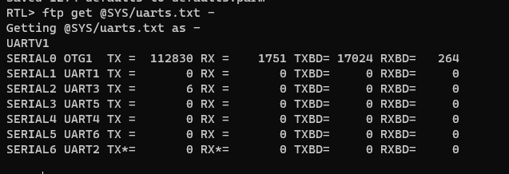

# mLRS Documentation: Additional Configuration for ArduPilot Systems #

([back to main page](../README.md))

Note: This page contains additional detail on certain configuration options that are applicable only to ArduPilot systems. Initial configuration should follow the process described within the [CRSF Telemetry and Yaapu Telemetry App](CRSF.md) page. If you are using a separate RC system and only want to have SiK functionality then you can refer to the [SiK Telemetry Replacement](docs/SETUP_SIK.md) page. 

## CRSF Receiver

Setting up ArduPilot for a CRSF receiver can be a bit tricky, as it depends on the flight controller board, and might need BRD_ALT_CONFIG to be set to a specific value. It is best to consult the ArduPilot wiki, or ask in the ArduPilot discussion channel.

CRSF works best on serial ports that have DMA enabled. This is only a concern on F4 and F7 flight controllers. The serial ports that have DMA enabled can be found by using the MAVProxy command 'ftp get @SYS/uarts.txt -', an '*' will denote serial ports that have DMA enabled (example for Matek F405 VTOL):

If you use a serial port without DMA, Mission Planner will show the message 'CRSF: running on non-DMA serial port' in the 'Messages' section.

For my Matek H743 board the configuration is:

- BRD_ALT_CONFIG = 1
- RC_PROTOCOLS = 536 or 512
- RSSI_TYPE = 3 or 5
- SERIAL7_BAUD = irrelevant (baud rate is determined by ArduPilot)
- SERIAL7_OPTIONS = 0
- SERIAL7_PROTOCOL = 23

Notes & References:
- [ArduPilot Docs for CRSF](https://ardupilot.org/copter/docs/common-tbs-rc.html)
- [ArduPilot Docs for RC_PROTOCOLS](https://ardupilot.org/plane/docs/parameters.html#rc-protocols-rc-protocols-enabled)
- [ArduPilot Docs for RSSI_TYPE](https://ardupilot.org/plane/docs/parameters.html#rssi-type-rssi-type)
- There are more RC options available in the 'RC_OPTIONS' parameter. ([ArduPilot Docs for RC_OPTIONS](https://ardupilot.org/plane/docs/parameters.html#rc-options-rc-options)) 

## Stream Rates

When configuring the SRy parameters, 'y' does not necessarily correspond to the serial port number but to the count of serial ports set to MAVLink. Here is an example with MAVLink on serial ports 0 and 3:

- Serial 0: SR0_
- Serial 3: SR1_

To understand how stream rates affect the MAVLink data rate, you can use this [calculator](https://github.com/ArduPilot/pymavlink/blob/master/tools/mavtelemetry_datarates.py) (requires Python).

## mLRS Rx Module

- Rx Snd RadioStat:
    - ardu_1: optimizes for ArduPilot usage
    - meth_b: optimizes for PX4 usage
