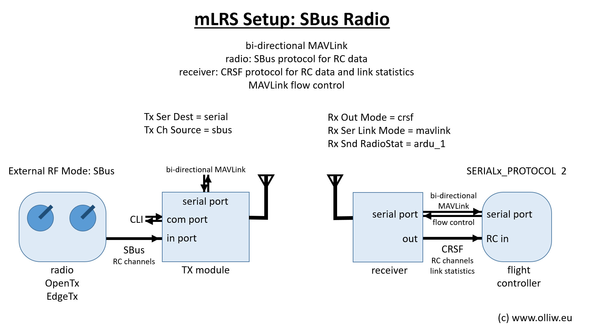

# mLRS Documentation: Basic Setup #

([back to main page](../README.md))

mLRS can work with any radio which provides an SBus output, which should be really every radio. This page describes a basic setup using a radio which provides an SBus output.

In this setup, the radio only sends RC data to the mLRS Tx module using the SBus protocol. As SBus is a unidirectional protocol, there is no communication from the mLRS Tx module to the radio. This means that it is not possible to have telemetry on the radio. The serial/MAVLink data stream is available via the serial/UART port on the mLRS Tx module, and it is up to you how to make use of it. When using SBus, the only options for configuration are the CLI or OLED (if available). It is not possible to use the Lua when using SBus.

For this basic setup, the mLRS Tx module needs to be put into "SBus mode". In addition, the radio needs to be set up for SBus, but this proceeds exactly as described in common tutorials. In principle, there is no specific configuration of the mLRS receiver neccessary. It is however recommended to set it up for CRSF instead of SBus if possible. If a MAVLink serial stream is used, then it is strongly recommended to also set the system into "MAVLink mode".

Note: An ArduPilot flight controller is assumed. For PX4 and iNav it needs to be tested and seen.

## mLRS Tx Module Setup

- Tx Ch Source = sbus
- Tx Ser Baudrate = 115200
- Tx Ser Dest = serial or serial2 (not mbridge!)
- Tx Snd RadioStat = off

If the serial data stream is MAVLink then it is recommended to set the respective parameters in the receiver (see next section).

## mLRS Receiver Setup

The configuration of the mLRS receiver can follow exactly the description in [CRSF Telemetry and Yaapu Telemetry App: mLRS Rx Module Setup](CRSF.md#mlrs-rx-module-setup), if CRSF can be used.

If your flight controller does not support CRSF but only SBus, then the paramneter "Rx Out Mode" needs to be set to "sbus" or "sbus inv", depending on the required polarity of the SBus signal.

## ArduPilot Setup

The configuration of the ArduPilot flight controller can follow exactly the description in [CRSF Telemetry and Yaapu Telemetry App: ArduPilot Setup](CRSF.md#ardupilot-setup), if CRSF can be used.

If your flight controller does not support CRSF but only SBus, then please consult the ArduPilot documentation. The SERIALx (serial port) and SRy (stream rates) parameters should hiowever be configures as described in [CRSF Telemetry and Yaapu Telemetry App: mLRS Rx Module Setup](CRSF.md#mlrs-rx-module-setup).

Note: Setting up ArduPilot for a SBus or CRSF receiver can be a bit tricky by times, and there can be more than one way to achieve it. It is best to consult the ArduPilot wiki, or ask in the ArduPilot discussion channel.
