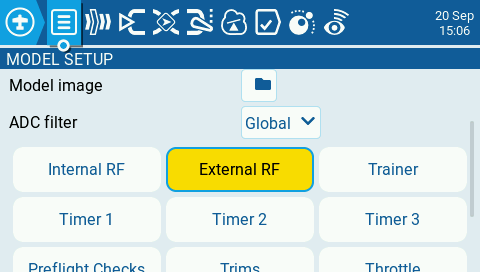

# mLRS Documentation: Configuration ID #

([back to main page](../README.md))

mLRS allows for 10 different configurations to be stored on the Tx module.  This is useful for when you want to use a single Tx module with multiple receivers and want to use different settings for each receiver.  For example, you may prefer to use 50 Hz mode on your copter but prefer to use 19 Hz mode on your rover. The active configuration ID is set based on the receiver number that is assigned on the MODEL SETUP page within the 'External RF' page/section of EdgeTx/OpenTx or via the 'setconfigid' CLI command. Note that when setting the configuration ID via the radio, this option is only available when using CRSF or mBridge protocols, SBUS will only use configuration ID 0.

Notes:
- The selected value for the Tx Ch Source parameter ("crsf", "in", "mbridge") will be applied to all configuration IDs.
- Any receiver number greater than 9 will use configuration ID 9.
- By default, each configuration ID has a unique bind phrase associated with it and will therefore require you to bind with the receiver that you want to use after changing the configuration ID.

## Changing the Receiver Number

Within EdgeTx/OpenTx, navigate to the MDL->MODEL SETUP page and then select the 'External RF' Section:

Change the receiver number to the slot you want to use:

The configuration ID currently in use is also available in the Lua script and on the OLED display.

