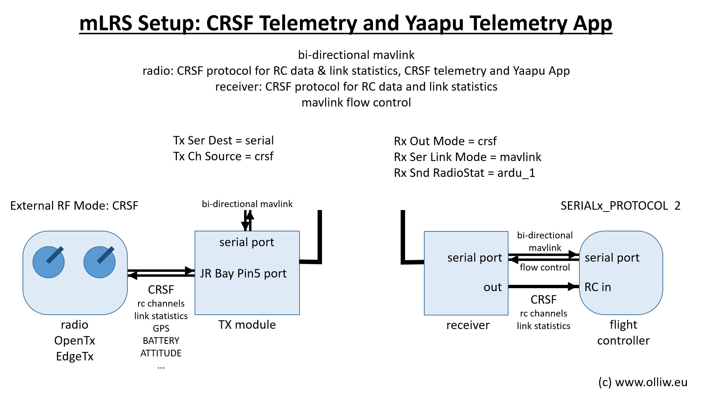

# mLRS Documentation: CRSF Telemetry and Yaapu Telemetry App #

([back to main page](../README.md))

This page describes how to set up a mLRS system for EdgeTX/OpenTX radios, so you get CRSF telemetry sensors and can use the Yaapu telemetry app.

Three steps need to be completed:
1. The radio needs to be setup for the CRSF protocol.
2. The mLRS Tx module needs to be put into "CRSF mode".
3. The flight controller needs to be set up to send a MAVLink stream with the desired MAVLink messages.

Optional but recommended steps:
- Install the mLRS Lua script on the radio to configure parameters: [Lua Script](LUA.md).
- Set the receiver into "MAVLink mode" (described below).
- Install the Yaapu app (described below).

> [!TIP]
> The mLRS default parameter settings follow the below recommendations. That is, with a freshly flashed mLRS Tx module and receiver all you need to do is to set up your radio and flight controller.

It is recommeneded that for first setup the Tx module and receiver are left in their default configuration. Once your system is up and running there is still time to explore the options for optimizing the performacne.

***Notes***:
- Any radio which supports the CRSF protocol should work, this should include many brands besides EdgeTX/OpenTX radios.
- An ArduPilot flight controller is assumed. PX4 and INAV needs to be tested and validated.

## Radio Setup

In EdgeTX/OpenTX, navigate to MDL->MODEL SETUP and configure the external RF module for CRSF protocol with 400K baud rate.

> [!IMPORTANT]
> mLRS only supports 400K baud rate.

## mLRS Tx Module Setup

Set the following parameters using the CLI or Lua script (or OLED if available):

- Tx Ch Source = crsf
- Tx Ser Baudrate: 115200
- Tx Ser Dest = serial or serial2 (not mbridge!)
- Tx Snd RadioStat = on

> [!TIP]
> The mLRS default settings are Tx Ch Source = crsf, Tx Ser Baudrate = 115200, Tx Ser Dest = serial, Tx Snd RadioStat = on. Therefore, except of Tx Ser Dest, adjustment of the parameters is usually not needed.

***Notes***: 
- Tx Ser Baudrate should be larger than the link data rate in order to provide enough capacity (e.g., in the 50 Hz mode the link data rate is 4100 Bytes/sec and the baudrate should thus be larger than 41000), but otherwise the choice is not critical and largely determined by the user's need. The default value is 115200, and is a good choice for most cases.
- While not necessary, for the FLRC mode it can be benefitial to use 230400.

## ArduPilot Setup

A basic setup of the ArduPilot parameters is described in this section which should get you started. Further ArduPilot information is available here: [ArduPilot Systems](ARDUPILOT.md).

### MAVLink Serial Port

- SERIALx_BAUD: 57 (= 57600)
- SERIALx_PROTOCOL = 2 (important, do not use MAVLink v1!)
- SERIALx_OPTIONS = 4096 (ignore commands from GCS to change stream rates)

***Note***: 'x' refers to the serial port of your flight controller used for connecting with the mLRS receiver's serial port.

The baud rate setting in SERIALx_BAUD is not critical, as mLRS will gracefully work with them all. However, depending on the ArduPilot firmware version, parameter download can be optimized somewhat by "tuning" the baudrate. For instance, one can try:
- 50 Hz and FSK: 115 (= 115200)
- 31 Hz: 57 (= 57600)
- 19 Hz: 38 (= 38400)
- FLRC: 230 (= 230400)
 
### Stream Rates

Generally, the stream rate settings are not critical, as mLRS will gracefully adjust them when needed. Suggested settings are:

<table>
  <tbody>
        <tr>
            <th></th>
            <th><strong>50 Hz</strong></th>
            <th><strong>31 Hz</strong></th>
            <th><strong>19 Hz</strong></th>
            <th><strong>FLRC</strong></th>
        </tr>
        <tr>
            <th><strong>SRy_ADSB</strong></th>
            <td>0</td>
            <td>0</td>
            <td>0</td>
            <td>0</td>
        </tr>
        <tr>
            <th><strong>SRy_EXT_STAT</strong></th>
            <td>2</td>
            <td>2</td>
            <td>1</td>
            <td>4</td>
        </tr>
        <tr>
            <th><strong>SRy_EXTRA1</strong></th>
            <td>4</td>
            <td>4</td>
            <td>4</td>
            <td>8</td>
        </tr>
        <tr>
            <th><strong>SRy_EXTRA2</strong></th>
            <td>4</td>
            <td>4</td>
            <td>4</td>
            <td>8</td>
        </tr>
        <tr>
            <th><strong>SRy_EXTRA3</strong></th>
            <td>2</td>
            <td>2</td>
            <td>1</td>
            <td>4</td>
        </tr>
        <tr>
            <th><strong>SRy_PARAMS</strong></th>
            <td>50</td>
            <td>50</td>
            <td>50</td>
            <td>50</td>
        </tr>
        <tr>
            <th><strong>SRy_POSITION</strong></th>
            <td>2</td>
            <td>2</td>
            <td>2</td>
            <td>4</td>
        </tr>
        <tr>
            <th><strong>SRy_RAW_CTRL</strong></th>
            <td>0</td>
            <td>0</td>
            <td>0</td>
            <td>0</td>
        </tr>
        <tr>
            <th><strong>SRy_RAW_SENS</strong></th>
            <td>0</td>
            <td>0</td>
            <td>0</td>
            <td>0</td>
        </tr>
        <tr>
            <th><strong>SRy_RC_CHAN</strong></th>
            <td>1</td>
            <td>1</td>
            <td>1</td>
            <td>2</td>
        </tr>
  </tbody>
</table>

***Note***: When configuring SRy parameters, 'y' does not necessarily correspond to the number 'x' of the SERIALx port but to the count of serial ports using the MAVLink protocol. SERIAL0, and thus SR0, will nearly always be reserved for the USB connection and set to use the MAVLink protocol (which should not be modified). Therefore, as an example, in a setup with SERIAL1 and SERIAL2 not set to the MAVLink and with the mLRS receiver connected to SERIAL3, then SR1 should be used to configured the stream rates for the mLRS receiver.

### CRSF Receiver Protocol

- RC_PROTOCOLS = 536 or 512
- RSSI_TYPE = 3 or 5
- SERIALx_BAUD = irrelevant (baud rate is determined by ArduPilot)
- SERIALx_OPTIONS = 0
- SERIALx_PROTOCOL = 23

***Note***: 'x' refers to the serial port of your flight controller used for CRSF. This port is different (!) to the serial port used for the MAVLink serial stream.

**If these settings do not work, more details are available on the [ArduPilot Systems](ARDUPILOT.md) page.**

## mLRS Receiver Setup

Set the following parameters using the CLI or Lua script (or OLED if available):

- Rx Out Mode = crsf
- Rx Ser Baudrate = must match the baudrate of the flight controller's serial port (see SERIALx_BAUD in the above)
- Rx Ser Link Mode = mavlinkX (this sets the receiver into "MAVLink mode")
- Rx Snd RadioStat= ardu_1

> [!TIP]
> The mLRS default settings are Rx Out Mode = crsf, Rx Ser Baudrate = 57600, Rx Ser Link Mode = mavlinkX, Rx Snd RadioStat= ardu_1. Therefore, if the above suggestions are followed, the receiver should work out of the box.  

## Yaapu Telemetry App Setup for EdgeTX/OpenTX

In EdgeTX/OpenTX go to MDL->TELEMETRY and select "Discover new sensors". You should see sensors appearing; mLRS currently provides 28 sensors ([CRSF Sensors](CRSF_SENSORS.md)).

Install the Yaapu app exactly as described in its wiki. Note: You need to install the dev version, the stable release version will not work. You need to enable the CRSF support: Start the "Yaapu Config" script in SYS->TOOLS, and set "enable CRSF support: yes" (then repower the radio). You can check if all is good by running the "Yaapu Debug CRSF" script in SYS->TOOLS.

## Demo

