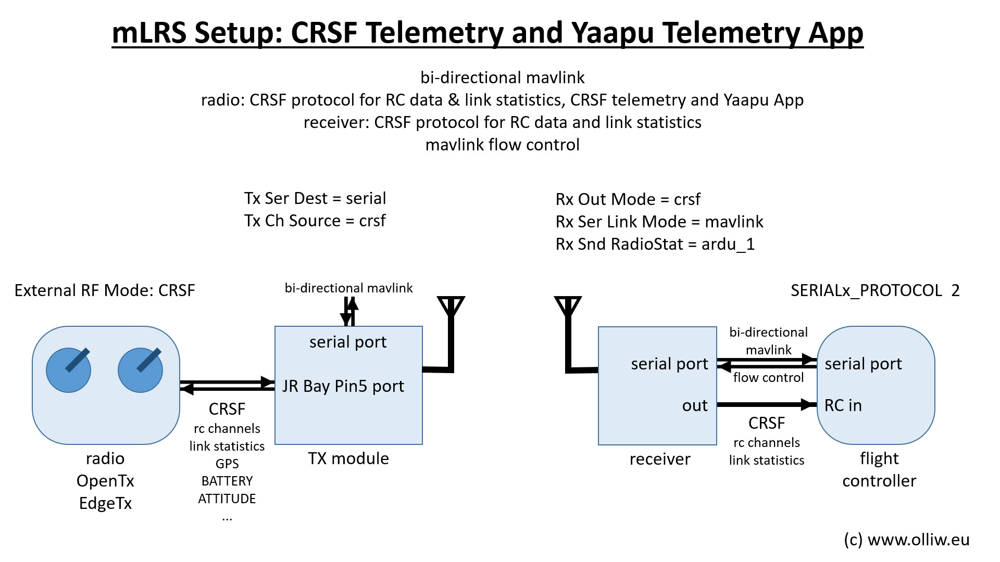

# mLRS Documentation: CRSF Telemetry and Yaapu Telemetry App #

([back to main page](../README.md))

This page describes how to set up an mLRS system for EdgeTX/OpenTX radios, so you get CRSF telemetry sensors and can use the Yaapu telemetry app.

Three steps need to be completed:
1. The radio needs to be setup for the CRSF protocol
2. The mLRS Tx module needs to be put into "CRSF mode"
3. The flight controller needs to be set up to send a MAVLink stream with the desired MAVLink messages

Optional but recommended steps:
- Install the mLRS Lua script on the radio to configure Tx and Rx parameters: [Lua Script](LUA.md)
- Set the receiver into "mavlink mode" (described below)
- Install the Yaapu app (described below)

Notes:
- Any radio which supports the CRSF protocol should work, this should include many brands besides EdgeTX/OpenTX radios.
- An ArduPilot flight controller is assumed. PX4 and INAV needs to be tested and validated.

## Radio Setup

In EdgeTX/OpenTX, navigate to MDL->MODEL SETUP and configure the external RF module for CRSF protocol with 400K baud rate.

## mLRS Tx Module Setup

Set the following parameters using the CLI or Lua script:

- Tx Ch Source = crsf
- Tx Ser Baudrate = 115200
- Tx Ser Dest = serial or serial2 (not mbridge!)
- Tx Snd RadioStat = off

Note: The choice of Tx Ser Baudrate is not critical and really determined by the user's need. It is recommended to set it to 57600 or higher, as this will provide enough speed for all operation modes (19 Hz, 31 Hz, 50 Hz).

## ArduPilot Setup

A basic setup is described in this section which should get one started, further ArduPilot information is available here: [ArduPilot Systems](ARDUPILOT.md)

### MAVLink Serial Port

- SERIALx_BAUD:
    - 230 for FLRC
    - 57 for 31 Hz, 50 Hz
    - 38 for 19 Hz (57 works very well too, only parameter download is slower)
- SERIALx_PROTOCOL = 2 (important, do not use MAVLink v1!)
- SERIALx_OPTIONS = 4096 (ignore commands from GCS to change stream rates)

Note: 'x' refers to the serial port of your flight controller used for MAVLink

### Stream Rates

- SRy_ADSB = 0
- SRy_EXT_STAT:
    - 2 for 31 Hz, 50 Hz
    - 1 for 19 Hz
- SRy_EXTRA1 = 4
- SRy_EXTRA2 = 4
- SRy_EXTRA3:
    - 2 for 31 Hz, 50 Hz
    - 1 for 19 Hz
- SRy_PARAMS = 50
- SRy_POSITION = 2
- SRy_RAW_CTRL = 0
- SRy_RAW_SENS = 0
- SRy_RC_CHAN = 1

Note: 'y' refers to the MAVLink stream number of the serial port, which is usually different to 'x' in SERIALx

### CRSF Receiver

- RC_PROTOCOLS = 536 or 512
- RSSI_TYPE = 3 or 5
- SERIALx_BAUD = irrelevant (baud rate is determined by ArduPilot)
- SERIALx_OPTIONS = 0
- SERIALx_PROTOCOL = 23

Note: 'x' refers to the serial port of your flight controller used for CRSF

**If these settings do not work, more details are available on the [ArduPilot Systems](ARDUPILOT.md) page**

## mLRS Rx Module Setup

Set the following parameters using the CLI or Lua script:

- Rx Out Mode = crsf
- Rx Ser Baudrate (must match the baudrate that the flight controller's MAVLink serial port is configured for):
    - 230400 for FLRC
    - 57600 for 31 Hz, 50 Hz
    - 38400 for 19 Hz (or 57600, see SERIALx_BAUD)
- Rx Ser Link Mode = mavlink
- Rx Snd RadioStat= ardu_1

## Yaapu Telemetry App Setup for EdgeTX/OpenTX

In EdgeTX/OpenTX go to MDL->TELEMETRY and select "Discover new sensors". You should see sensors appearing; mLRS currently provides 28 sensors. ([CRSF Sensors](CRSF_SENSORS.md))

Install the Yaapu app exactly as described in its wiki. Note: You need to install the dev version, the stable release version will not work. You need to enable the CRSF support: Start the "Yaapu Config" script in SYS->TOOLS, and set "enable CRSF support: yes" (then repower the radio). You can check if all is good by running the "Yaapu Debug CRSF" script in SYS->TOOLS.

## Demo

