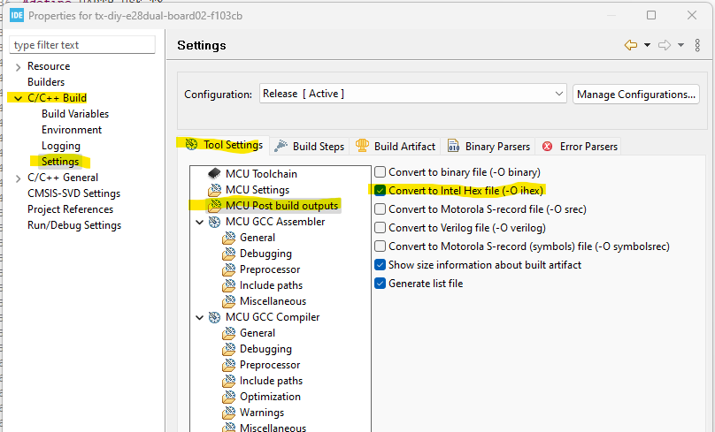

# mLRS Documentation: STM32CubeIDE Outputs #

([back to main page](../README.md))

To enable Binary or Hex file outputs, use the following steps for each project:

- Right Click on the Project in the Project Explorer Window select 'Properties'
- Expand C/C++ Build
- Select Settings
- Select 'Tool Settings' Tab
- Select 'MCU Post build outputs'
- Select 'Convert to binary file (-O binary)
- Select 'Convert to Intel Hex file (-O ihex)
- Click Apply

