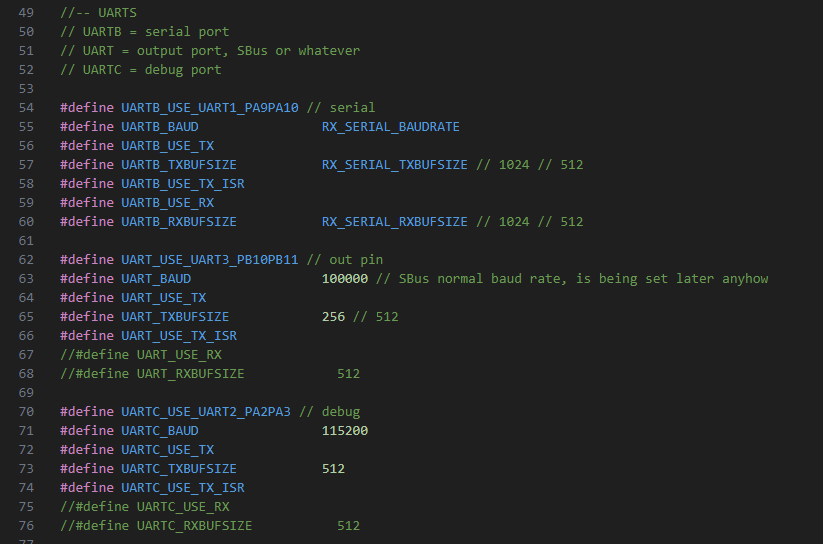

# mLRS Documentation: Custom Boards & Targets #

([back to main page](../README.md))

While mLRS offers a variety of hardware options, you may find it beneficial for your application to create a custom board to better suit your objectives.  This page describes how to use the existing codebase to enable the use of custom boards and custom targets.

## Definitions

- 'Board' refers to the physical hardware
- 'Target' refers to the firmware that will run on the board

## Assumptions

1. You have setup the build environment for mLRS
2. You are comfortable with C/C++ programming

## Creating a target for a custom board

There are a number of ways of how to create a target for a custom board, for example:
- A simple way would be to identify an existing board which is close to your custom board and modify the entries in this boards hal file.
- A more advanced way would be to create a new target as you find them for the existing boards. This requires more work and additional skills.

The simple way:

1. Identify a target which is close to your new board. Example: The `rx-diy-board01-f103cb` target may be it.
    - Note: The only condition when picking a target is that you will need to choose a target which uses the same MCU as your custom board, in this example it is assumed that you are using the STM32F103CBXX on your custom board.
2. Copy the existing target's hal file and rename it to what you want it to be. Example: Copy `/Common/hal/rx-hal-diy-board01-f103cb.h` to `/Common/hal/rx-hal-diy-customboard-f103cb.h`.
3. In `/Common/hal/hal.h` go to the area where the existing target's hal file is included, comment out the include, and add a line which includes your hal file. Example: Find the line with `#include "rx-hal-diy-board01-f103cb.h"`, replace it with `\\#include "rx-hal-diy-board01-f103cb.h"` and insert a line `#include "rx-hal-diy-customboard-f103cb.h"`.
4. In `/Common/hal/device_conf.h` go to the area where the existing target is defined, comment out the define of the device name, and add your own define changing the device name to what you want it to be. Example: Find the line with `#ifdef RX_DIY_BOARD01_F103CB`, replace the subsequent line with `\\#define DEVICE_NAME "DIY DualSX F103CB"` and insert a line `#define DEVICE_NAME "My Own Great Board"`
    - Note: The device name can be 20 characters max.
5. Modify the target's device_conf entry and hal file to match the features of your custom board - further detailed below.

The advanced way:

Detailed [here](https://github.com/olliw42/mLRS/blob/main/mLRS/CREATE_TARGET_INSTRUCTIONS.md)

## Creating a Debug target

After creating a target using the 'advanced way' for a 'Release' target, a 'Debug' target can be created by following these steps:

- At step 10, select 'Debug' instead of 'Release'
- Follow steps 12, 13 and 16 exactly
- If the target uses USB, follow step A1.2 exactly

## Modifying a target

The codebase has two locations that defines the features and capabilities of a target:
1. Device Conf
    1. Defines the device name, type (Tx/Rx), Sx chipset, frequencies
    2. Location: `mLRS/mLRS/Common/hal/device_conf.h`
        
2. Target Hal
    1. Defines the features, UART assignment and pin mapping
    2. Location: `mLRS/mLRS/Common/hal/MY-CUSTOM-TARGET.h`
    3. Available features are listed in hal.h: `mLRS/mLRS/Common/hal/hal.h`

## Example - Enabling 433 MHz / 70 cm frequencies

Let's say that you want to use the 433 MHz frequency bands with the RX DIY E77 Target.  In this case, you'll need to modify the device_conf.h to include these frequencies before building the firmware (can be done by uncommenting lines 226 and 227):

## Example - Adding a feature

Let's say that you are using the Wio E5 Grove as a receiver and want to use CRSF out for rc channels.  In this case, you'll need to update the E5 Grove Hal to enable the out feature before building the firmware (can be done by uncommenting line 19):

Note: The full list of available features are listed in hal.h which is located at `mLRS/mLRS/Common/hal/hal.h`

## Example - Reassigning Pins

Let's say you want to use a different pin for the button on the E28 G441 receiver.  In this case, you'll need to update line 153 in the hal which defines the button:

Note:  All pin names needs to be prefixed with 'IO_'

## Example - Reassigning UARTs

Let's say that you want to use UART1 (PA9, PA10) for the serial connection and UART3 (PB10, PB11) for debug on the E28 Dual STM32F1 board.  In this case, you'll need to update line 34 to use UART1 and update line 50 to use UART3:

Notes:

The function of the UART is specified by the letter and is specific to both Tx and Rx:

Tx / Rx | UART   | Function     |                                                   
------- | ------ | ------------ |
Tx      | UART   | JR Pin 5     |
Tx      | UARTB  | Serial       |
Tx      | UARTC  | COM / CLI    |
Tx      | UARTD  | Serial 2     |
Tx      | UARTE  | In           |
Tx      | UARTF  | Debug        |
Rx      | UART   | Out          |
Rx      | UARTB  | Serial       |
Rx      | UARTC  | Debug        |

If you want to use alternative pins for the UART please refer to the table below:

For example, if you want to use pins PB6 and PB7 for UART1 on UARTB the correct syntax would be `UARTB_USE_UART1_REMAPPED`