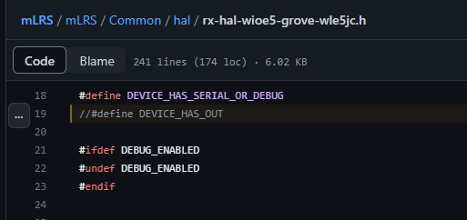

# mLRS Documentation: Custom Targets #

([back to main page](../README.md))

This page describes how modify the existing codebase to enable custom targets.

There are two assumptions:
1. You have setup the build environment for mLRS
2. You are comfortable with C/C++ programming

The codebase has two locations that defines the features and capabilites of a target:
1. Device Conf
    1. Defines the device name, type (Tx/Rx), Sx chipset, frequencies
    2. Location: mLRS/mLRS/Common/hal/device_conf.h
        
2. Target Hal
    1. Defines the features and pinout
    2. Location: mLRS/mLRS/Common/hal/TARGET.h
    3. Available features are listed in hal.h: mLRS/mLRS/Common/hal/hal.h

## Example - Adding a feature

Let's say that you are using the Wio E5 Grove as a receiver and want to use CRSF out for rc channels.  In this case, you'll need to update the E5 Grove Hal to enable the out feature before building the firmware(can be done by uncommenting line 19):
    

## Example - Enabling 433 MHz / 70 cm frequencies

Let's say that you want to use the 433 MHz frequncy bands with the RX DIY E77 Target.  In this case, you'll need to modify the device_conf.h to include these frequencies before building the firmware (can be done by uncommenting lines 226 and 227):

## Example - Reassigning Pins

## Example - Reassign UARTs

