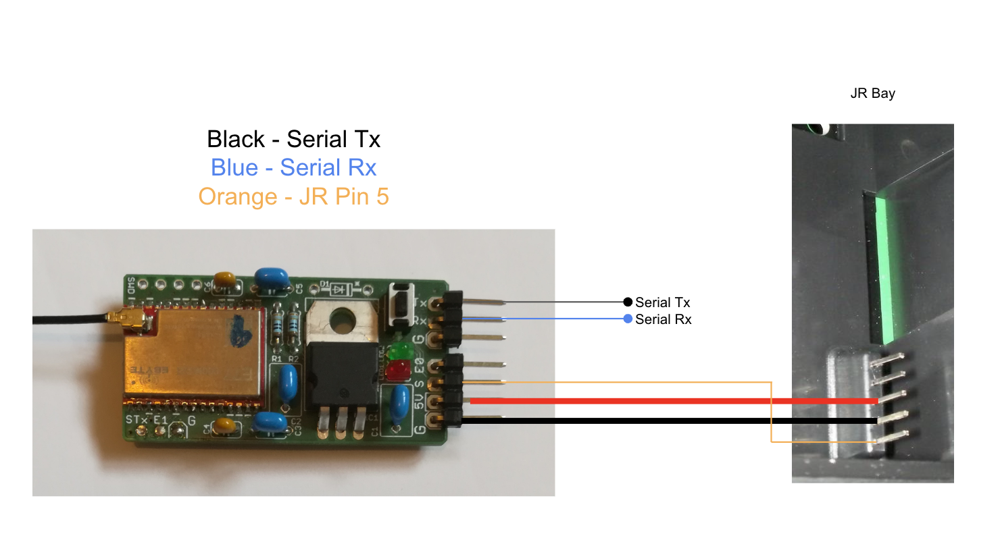
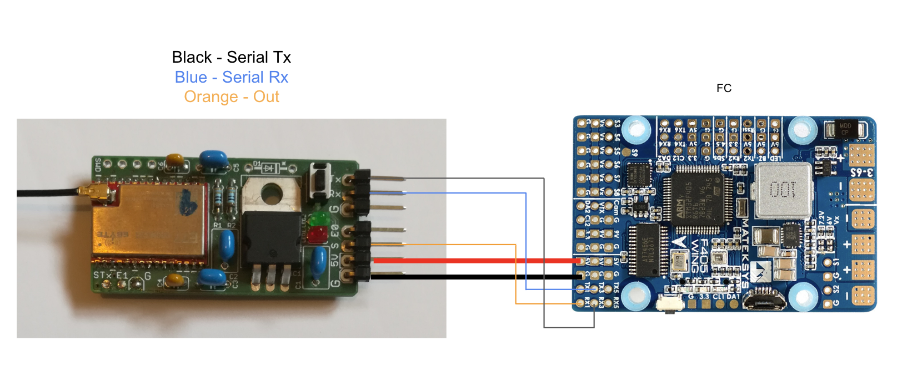
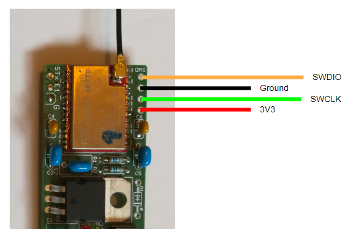

# mLRS Documentation: E77 Easy Solder Boards #

([back to main page](../README.md))

The E77 Easy Solder Boards are designed to allow one with minimal soldering skills to build their own mLRS hardware. All of the parts except for the E77 module are through-hole parts to aid in assembly. These boards are flexible in that they can be used as a Tx module, receiver or a SiK replacement. Additionally, these boards support diversity when paired with an additional E22 module.

<table>
  <tbody>
    <tr>
      <td>Frequency Bands</td>
      <td>868 MHz/915 MHz (E77-900M22S) or 433 MHz/70 cm (E77-400M22S)</td>
    </tr>
    <tr>
      <td>Max. RF Output Power</td>
      <td>22 dBm (158 mW)</td>
    </tr>
    <tr>
      <td>Supported Modes</td>
      <td>31 Hz, 19 Hz</td>
    </tr>
  </tbody>
</table>

Note:
- EByte has silently changed the hardware of the E77 module in around begining 2024, and the required firmware depends on it. The newer modules use a (better) TCXO, while the older modules use a ceramic crystal oscillator. According to the datasheet the newer modules can be identified by a serial number SN &#8805; 3202995. For the older modules use the firmware with the label "-xtal" in the name.

### As Tx Module ###

Connections (name in respect to board print-ons, otherwise please refer to graphic):

<table>
  <tbody>
    <tr>
      <td>serial:</td><td>Tx, Rx</td>
    </tr><tr>
      <td>com / cli:</td><td>Tx, Rx</td>
    </tr><tr>
      <td>JRPin5 / in:</td><td>S</td>
    </tr><tr>
      <td>bind:</td><td>button</td>
    </tr><tr>
      <td>debug:</td><td>STx</td>
    </tr>
  </tbody>
</table>

Note: To enable the cli, hold down the bind button during boot.

### As Receiver ###

Connections (name in respect to board print-ons, otherwise please refer to graphic):

<table>
  <tbody>
    <tr>
      <td>serial:</td><td>Tx, Rx</td>
    </tr><tr>
      <td>out:</td><td>S</td>
    </tr><tr>
      <td>bind:</td><td>button</td>
    </tr><tr>
      <td>debug:</td><td>STx</td>
    </tr>
  </tbody>
</table>

Note: In order to send RC channels over the serial connection (no need for OUT wire), change the "Rx Snd RcChannel" parameter to 'rc override' (or 'rc channels' if possible).

## Flashing ##

**Important: Every time that you power a board you should ensure that there is an antenna connected otherwise you risk damaging the RF section.**

- Download and install [STM32CubeProgrammer](https://www.st.com/en/development-tools/stm32cubeprog.html)
- Connect your ST-Link to the 3V3, GND, SWD, and SWCLK pins on the board (image below)
    - Refer to the diagrams above
    - Some ST-Link boards provide power and some do not - ensure the board is powered
- Launch STM32CubeProgrammer and select ST-Link as the connection method, click connect
- From the menu on the left select the Download tile
- Select the correct firmware in the Download section, click Start Program
- Power cycle the board, the red LED should blink which indicates that the board is disconnected

Notes:

If you are unable to to flash due to readout protection, perform the following steps after connecting to the device:
- From the menu on the left select the OB (Option Bytes) tile
- From the Read Out Protection section, change to AA, select Apply
    - This will erase the current firmware

## Building ##

As mentioned in the introduction, with the exception of the E77 and E22 modules the board uses only through-hole parts, which makes soldering as simple as possible. Moreover, standard parts are mostly used, which should help with sourcing. Only the two 1.8 mm LEDs are somewhat special and less common, but can be substituted with standard 3 mm LEDs if necessary. 

### PCB ###

The electronic scheme and board design files, as well as Gerber files for ordering PCBs, can be found [here](https://github.com/olliw42/mLRS-hardware/tree/master/olliw-stm32-based/rx-tx-E77-E22-dual-easysolder).

### BOM ###

<table>
  <tbody>
    <tr>
      <td>R1,R2</td><td>330, 1/4 W</td>
    </tr><tr>
      <td>C1,C2,C3,C5*</td><td>10u, RM3</td>
    </tr><tr>
      <td>C4,C6*</td><td>100n, RM2</td>
    </tr><tr>
      <td>IC1</td><td>LD1117AV33, TO220, low drop fixed voltage regulator 3.3 V, 1 A</td> 
    </tr><tr>
      <td>IC2</td><td>Ebyte E77-900M22S</td>
    </tr><tr>
      <td>IC3*</td><td>Ebyte E22-900M22S</td>
    </tr><tr>
      <td>LED1</td><td>red LED 1.8 mm</td>
    </tr><tr>
      <td>LED2</td><td>green LED 1.8 mm</td>
    </tr><tr>
      <td>SW1</td><td>button 6 x 3.5 mm</td>
    </tr>
  </tbody>
</table>

\* The parts C5, C6 and IC3 are only required, and only need to be populated, when diversity is desired. 

For convenience, a Mouser list is available [here](https://eu.mouser.com/ProjectManager/ProjectDetail.aspx?AccessID=b60c19cf3a&_gl=1*nmaj37*_ga*OTEyNjU5NzcwLjE2NzU2MzU2MjQ.*_ga_15W4STQT4T*MTY5NjI2NzIzMS4xMS4wLjE2OTYyNjcyMzIuNTkuMC4w). The Ebyte modules can be purchased on Aliexpress.

 
