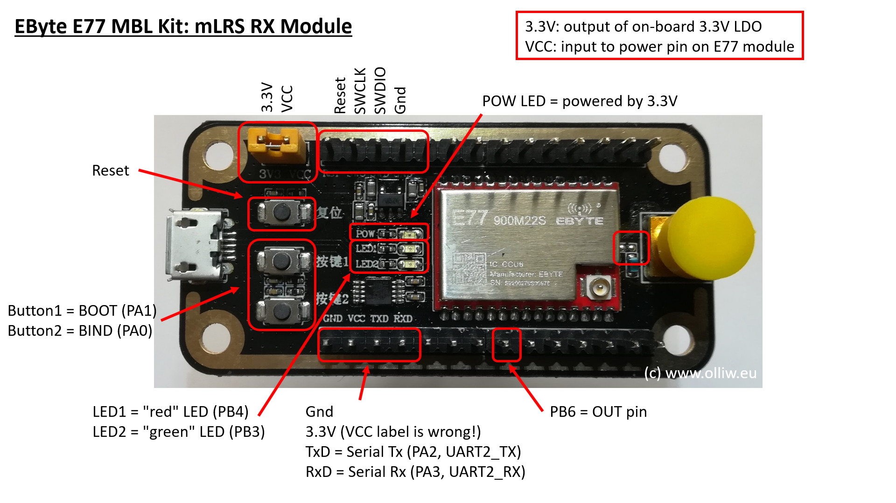

# mLRS Documentation: EBYTE E77 MBL Boards #

([back to main page](../README.md))

EBYTE E77 MBL Boards are an option for building mLRS equipment. These boards use the EBYTE E77 module and are available in both 868/915 MHz and 433 MHz/70 cm versions. However, these boards are not perfect since their pins are not ready-made for the purposes of mLRS. So, some tweaking and (easy) soldering is required.

**Important: If you are planning to use the SMA connector, ensure that a 0 ohm resistor is populated as multiple users have reported that it is not present by default.  Refer to the red square next to the SMA connector in the diagrams below for the location.**

## EBYTE E77 MBL Boards ##

- [E77-400MBL-01](https://www.cdebyte.com/products/E77-400MBL-01)
- [E77-900MBL-01](https://www.cdebyte.com/products/E77-900MBL-01)

### As Tx Module ###

Connections (name in respect to board print-ons, otherwise please refer to graphic):

- serial: TxD,RxD and on-board USB plug
- com/cli: TxD,RxD and on-board USB plug
- debug: PA5
- button1: BOOT
- button2: cli / BIND

Notes:

- To communicate with the radio via the JR bay (pin 5 in the JR bay), you need to solder a Schottky diode (e.g. BAT42) between pads PB7 and PB6 (see graphic)
- To enable the cli, hold down button2 during boot
- To enter system bootloader, hold down button1 during boot

### As Rx Module ###

Connections (name in respect to board print-ons, otherwise please refer to graphic):

- serial: TxD,RxD and on-board USB plug
- out: PB6
- debug: PA5
- button1: BOOT
- button2: BIND

Notes:

- To enter system bootloader, hold down button1 during boot

## Flashing the Modules ##

**Important: Every time that you power a board you should ensure that there is an antenna connected otherwise you risk damaging the RF section.**

### Initial Flashing ###

The first time that you flash the mLRS firmware to an E77 MBL board you'll have to do the following:

- Download and install [STM32CubeProgrammer](https://www.st.com/en/development-tools/stm32cubeprog.html)
- Connect your ST-Link to the 3V3, GND, SWD, and SWCLK pins on the board
    - Refer to the diagrams above
    - Some ST-Link boards provide power and some do not - ensure the E77 MBL board is powered
- Launch STM32CubeProgrammer and select ST-Link as the connection method, click connect
- From the menu on the left select the Download tile
- Select the correct firmware in the Download section, click Start Program
- Power cycle the board, the red LED should blink which indicates that the board is disconnected

Notes:

If you are unable to to flash due to readout protection, perform the following steps after connecting to the device:
- From the menu on the left select the OB (Option Bytes) tile
- From the Read Out Protection section, change to AA, select Apply
    - This will erase the current firmware

### Subsequent Flashing ###

Subsequent flashing can be done in two ways:
1. Follow the initial flashing process
2. Boot into the system bootloader using the boot button, cli, lua or the OLED display
    - This enables programming over the USB port which is connected to UART2 (PA2, PA3)
    - Alternatively, use UART1 (PA9, PA10) with a USB-TTL adapter and the Serial connection option in STM32CubeProgrammer