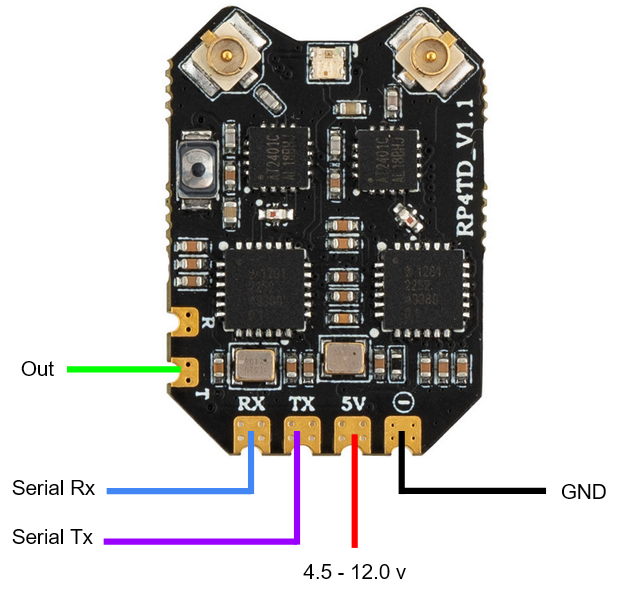
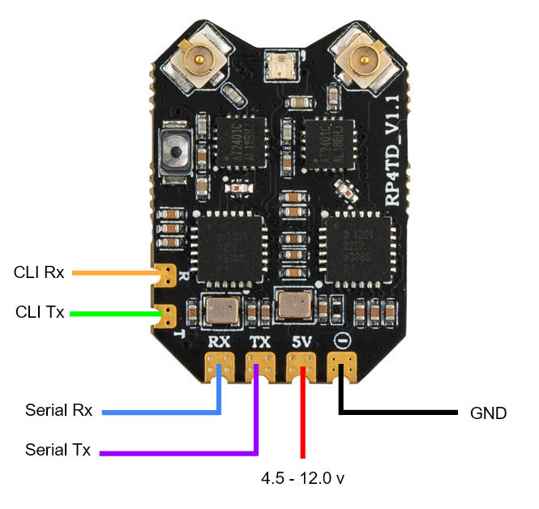

# mLRS Documentation: RadioMaster RP4TD Receiver #

([back to main page](../README.md))

The RadioMaster RP4TD is a good option for a 2.4 GHz receiver as it offers true diversity, PA & LNA, dual TCXO and additional pads for RC out functionality.  Furthermore, it is able to be used as a Tx module with SiK like functionality.

<table>
  <tbody>
    <tr>
      <td>Frequency Band</td>
      <td>2.4 GHz</td>
    </tr>
    <tr>
      <td>Max. RF Output Power</td>
      <td>20 dBm (100 mW)</td>
    </tr>
    <tr>
      <td>Supported Modes</td>
      <td>111 Hz, 50 Hz, 31 Hz, 19 Hz</td>
    </tr>
    <tr>
      <td>LoRa Chipset</td>
      <td>SX128x</td>
    </tr>
  </tbody>
</table>

### As Receiver ###

Connections (name in respect to board print-ons, otherwise please refer to graphic):

<table>
  <tbody>
    <tr>
      <td>serial:</td><td>TX, RX</td>
    </tr><tr>
      <td>out:</td><td>T</td>
    </tr><tr>
      <td>bind:</td><td>button</td>
    </tr>
  </tbody>
</table>

> [!TIP]
> In order to send RC channels over the serial connection (which avoids the additional OUT wire), change the "Rx Snd RcChannel" parameter to 'rc override', or preferably 'rc channels' if possible.

### As Tx Module ###

Connections (name in respect to board print-ons, otherwise please refer to graphic):

<table>
  <tbody>
    <tr>
      <td>serial:</td><td>TX, RX</td>
    </tr><tr>
      <td>com / cli:</td><td>T, R</td>
    </tr><tr>
      <td>bind:</td><td>button</td>
    </tr>
  </tbody>
</table>

## Flashing ##

Follow the steps as outlined [here](ELRS_RECEIVERS.md#flashing).
