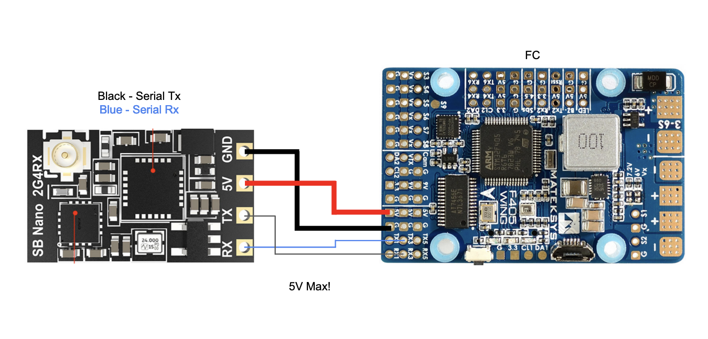

# mLRS Documentation: ELRS Receivers #

([back to main page](../README.md))

> [!IMPORTANT]
> 868/915 MHz ELRS receivers are only compatible with the Frsky R9M and RadioMaster Bandit Tx modules; they are incompatible with SX126x/STM32WLE hardware (MatekSys mR900, SeeedStudio Wio-E5, EBYTE E77 MBL, E77 Easy Solder)(see [here](SX126x_SX127x_INCOMPATIBILITY.md)).

## Selected ELRS Receivers ##

The following receivers are good choices. They support &#8805; 100 mW, are affordable, and have been validated by the mLRS team.

| Product Name           | Frequency Band | Transmit Power  | Notes                                           |
| ---------------------- | -------------- | --------------- | ----------------------------------------------- |
| Bayck 915M Nano Pro    | 868/915 MHz    | 27 dBm (500 mW) | PA + LNA                                        |
| RadioMaster XR4        | 868/915 MHz    | 20 dBm (100 mW) | True Diversity, TCXO, 2nd Serial Port           |
| BetaFPV SuperD 2.4G    | 2.4 GHz        | 20 dBm (100 mW) | True Diversity, PA + LNA, TCXO                  |
| RadioMaster [RP4TD](ELRS_RADIOMASTER_RP4TD.md#mlrs-documentation-radiomaster-rp4td-receiver) 2.4G | 2.4 GHz | 20 dBm (100 mW) | True Diversity, PA + LNA, TCXO, 2nd Serial Port |
| SpeedyBee Nano 2.4G    | 2.4 GHz        | 20 dBm (100 mW) | PA + LNA                                        |

## Supported ELRS Receivers ##

Additionally, the following ELRS receiver targets are also supported:

| Target              | Transmit Power   | Notes                                                         |
| ------------------- | ---------------- | ------------------------------------------------------------- |
| Generic 900         | 17 dBm (50 mW)   |                                                               |
| Generic 900 PA      | 27 dBm (500 mW)  | PA + LNA                                                      |
| Generic 900 TD PA   | 27 dBm (500 mW)  | True Diversity, PA + LNA                                      |
| RadioMaster BR3 900 | 27 dBm (500 mW)  | PA + LNA, single antenna only                                 |
| Generic 2400        | 12.5 dBm (18 mW) | Also found on AIO FCs with integrated ELRS receiver           |
| Generic 2400 PA     | 20 dBm (100 mW)  | PA + LNA                                                      |
| Generic 2400 D PA   | 23 dBm (200 mW)  | PA + LNA, single antenna only                                 |
| Generic 2400 TD PA  | 20 dBm (100 mW)  | True Diversity, PA + LNA                                      |
| Generic LR1121 TD   | 20 dBm (100 mW)  | True Diversity, 900 MHz only, SX126x compatible               |
| Generic C3 LR1121   | 20 dBm (100 mW)  | 900 MHz only, SX126x compatible                               |

To determine if your receiver hardware is supported with one of the generic targets, go to [ELRS Targets](https://github.com/ExpressLRS/targets/blob/master/targets.json) and look up the layout file that your hardware uses. Alternatively, you can use this browser based tool to look up the layout of your target: [ELRS Layout File Search](https://sunjunkim.github.io/elrs_target_search/) 

## Connections ##

All ELRS receivers have a standardized pinout and will need to be connected to the FC as follows:

***Note***: In order to send RC channels over the serial connection, change the Rx Snd RcChannel parameter to 'rc override'.

## Flashing ##

Flashing receivers is done using the mLRS Flasher Desktop App - this is found [here](https://github.com/olliw42/mLRS-Flasher).

Two methods are supported:
1. ESPTool with UART
2. ArduPilot Passthrough

### Steps to flash using ESPTool with UART ###

1. Launch the mLRS Flasher Desktop App
2. Connect the receiver to a USB<>UART
3. Power up the receiver while holding down the button
4. Select the correct serial port
5. Click Flash Receiver, wait for the flash to finish
6. Power cycle the receiver

### Steps to flash using ArduPilot Passthrough ###

1. Launch the mLRS Flasher Desktop App
2. Connect the flight controller via USB
3. Select the flight controller SERIAL port that the receiver is connected to
4. Click Flash Receiver
5. Wait for the console to appear and find the flight controller
6. Unplug the flight controller, then power up while holding down the receiver button
7. Wait 30 seconds for the flight controller to boot
8. Press enter in the console to continue, wait for the flash to finish
9. Power cycle the receiver

> [!NOTE]
> - Once the firmware has been written successfully, power cycle the receiver/FC. The LED should blink to indicate that it is looking for a connection.
> - Binding can be done by holding down the button for four seconds if it doesn't connect automatically.
