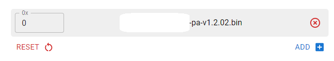
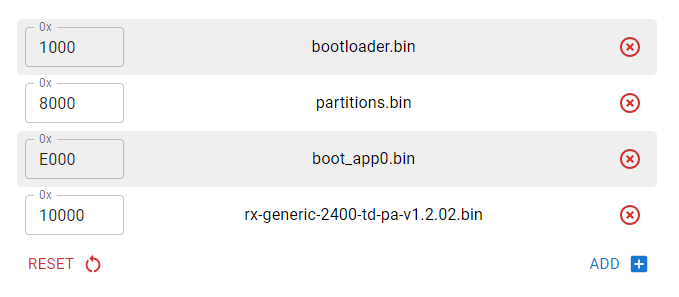

# mLRS Documentation: ELRS Receivers #

([back to main page](../README.md))

> [!IMPORTANT]
> 868/915 MHz ELRS receivers are only compatible with the Frsky R9M Tx module; they are incompatible with SX126x/STM32WLE hardware (MatekSys mR900, SeeedStudio Wio-E5, EBYTE E77 MBL, E77 Easy Solder)(see [here](SX126x_SX127x_INCOMPATIBILITY.md)).

## Selected ELRS Receivers ##

The following receivers are good choices. They support &#8805; 100 mW, are affordable, and have been validated by the mLRS team.

| Product Name           | Frequency Band | Transmit Power  | Notes                                           |
| ---------------------- | -------------- | --------------- | ----------------------------------------------- |
| Bayck 915M Nano Pro    | 868/915 MHz    | 27 dBm (500 mW) | PA + LNA                                        |
| Radiomaster XR4        | 868/915 MHz    | 20 dBm (100 mW) | True Diversity, TCXO, 2nd Serial Port           |
| BetaFPV SuperD 2.4G    | 2.4 GHz        | 20 dBm (100 mW) | True Diversity, PA + LNA, TCXO                  |
| RadioMaster [RP4TD](ELRS_RADIOMASTER_RP4TD.md#mlrs-documentation-radiomaster-rp4td-receiver) 2.4G | 2.4 GHz | 20 dBm (100 mW) | True Diversity, PA + LNA, TCXO, 2nd Serial Port |
| SpeedyBee Nano 2.4G    | 2.4 GHz        | 20 dBm (100 mW) | PA + LNA                                        |

## Supported ELRS Receivers ##

Additionally, the following ELRS receiver targets are also supported:

| Target              | Transmit Power   | Notes                                                         |
| ------------------- | ---------------- | ------------------------------------------------------------- |
| Generic 900         | 17 dBm (50 mW)   |                                                               |
| Generic 900 PA      | 27 dBm (500 mW)  | PA + LNA                                                      |
| Generic 900 TD PA   | 27 dBm (500 mW)  | True Diversity, PA + LNA                                      |
| RadioMaster BR3 900 | 27 dBm (500 mW)  | PA + LNA, single antenna only                                 |
| Generic 2400        | 12.5 dBm (18 mW) |                                                               |
| Generic 2400 PA     | 20 dBm (100 mW)  | PA + LNA                                                      |
| Generic 2400 D PA   | 23 dBm (200 mW)  | PA + LNA, single antenna only                                 |
| Generic 2400 TD PA  | 20 dBm (100 mW)  | True Diversity, PA + LNA                                      |
| Generic LR1121 TD   | 20 dBm (100 mW)  | True Diversity, 900 MHz only, SX126x compatible               |
| Generic C3 LR1121   | 20 dBm (100 mW)  | 900 MHz only, SX126x compatible                               |

To determine if your receiver hardware is supported with one of the generic targets, go to [ELRS Targets](https://github.com/ExpressLRS/targets/blob/master/targets.json) and look up the layout file that your hardware uses. Alternatively, you can use this browser based tool to look up the layout of your target: [ELRS Layout File Search](https://sunjunkim.github.io/elrs_target_search/) 

## Connections ##

All ELRS receivers have a standardized pinout and will need to be connected to the FC as follows:

***Note***: In order to send RC channels over the serial connection, change the Rx Snd RcChannel parameter to 'rc override'.

## Flashing ##

- Download the firmware for your receiver.
    - The latest pre-release is found [here](https://github.com/olliw42/mLRS/tree/main/firmware/pre-release-esp).
    - The latest official release is found [here](https://github.com/olliw42/mLRS/releases).
- To prepare your receiver for flashing, you will need to connect it to a USB<>UART, follow the normal connections:
    - 5V to 5V
    - GND to GND
    - Tx to Rx
    - Rx to Tx
- When powering on the receiver you will need to have the boot/bind button pushed down to enter into bootloader mode.
    - For receivers with a single (non-RGB) LED you can confirm the receiver is in bootloader mode if the LED is solid.
- If you have already connected your receiver to your ArduPilot flight controller or if your ELRS receiver is built-in, you can use your flight controller with serial passthrough instead of an USB<>UART adapter. This option requires ArduPilot version 4.5.2 or newer.
    - Connect to your flight controller via USB using a MAVLink GCS on your PC.
	- Set SERIAL\_PASSTIMO to 0 to prevent timeout. Check SERIAL\_PASS1 which should already be 0.
	- Set SERIALx_PROTOCOL to 28 ("Scripting") where x is the serial port number connected to your receiver. This prevents MAVLink message traffic from confusing the bootloader before we enable passthrough below. If you have scripts which use UART.write(), disable them.
	- If you wish, you can set SERIALx_BAUD for use with mLRS/MAVLink at this time, though this setting does not matter while flashing.
	- Power off both the flight controller and receiver (Unplug USB and power if connected)
	- Power back up again while holding the boot/bind button down and confirm the LED is on solid.
	- Connect your GCS again via USB.
	- If you wish, you can set the SERIALx\_PROTOCOL parameter back to 2 ("MAVLink2") at this time so you don't need to set it after flashing. But don't reboot or power cycle this time because we don't want it to take effect yet.
	- Set SERIAL\_PASS2 to x, the serial port number your receiver is connected to. Don't forget to write parameters if you are using Mission Planner or another GCS which requires this. This step will start passthrough and cause the GCS to report communication lost. Note that this parameter will revert to -1 and disable passthrough when you power cycle the FC after flashing.
	- Exit the GCS program so the FC USB serial port is available for flashing.
- Open a supported browser (Chrome, Edge, Opera, not Firefox) and navigate [here](https://esp.huhn.me/).
- Click connect and select the serial port of your USB<>UART or FC.
- Click erase.
- For ESP8266 based receivers:
    - Upload the .bin file for your receiver:   
    - Click program.
- For ESP32 based receivers:
    - Download the additional files needed for flashing  [here](https://github.com/olliw42/mLRS-docu/raw/master/docs/files/esp32_files.zip) and unpack them.
    - Create additional entries with the following offsets and files. Note: the firmware.bin should use the 10000 offset.   
    - Click program.
- Once the firmware has been written successfully, power cycle the receiver/FC. The LED should blink to indicate that it is looking for a connection.
    - ***Note***: Binding can be done by holding down the button for four seconds if it doesn't connect automatically.
