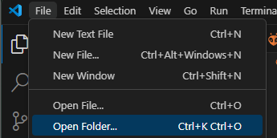
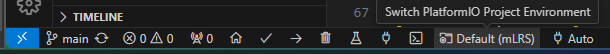
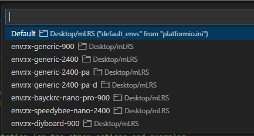
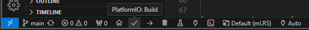
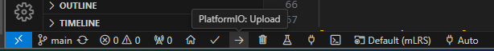

# mLRS Documentation: Building and Flashing for ESP Devices #

([back to main page](../README.md))

For ESP targets, the project uses PlatformIO with Visual Studio Code, and the Arduino framework with Espressif cores.

## Software: Installation Bits and Bops

### Prerequisites ####

1. Install Visual Studio Code, which can be found here: [VSCode](https://code.visualstudio.com/)
2. Install the PlatformIO extension, which is done within VSCode: [PlatformIO Instructions](https://platformio.org/install/ide?install=vscode)
3. Install Python 3 and make sure that it is added to your environment/path variable.
4. Install Git and make sure that it is added to your environment/path variable.

Let's assume that the project should be located in the folder `C:/Me/Documents/Github/mlrs`.

### Clone and Setup the Project Files ###

- Open a command line processor and navigate to this directory:
    - `cd C:/Me/Documents/Github/`
    - ***Note***: not C:/Me/Documents/Github/mlrs!
- Clone the repository to your local machine using the following command:
    - `git clone https://github.com/olliw42/mLRS.git mlrs`
- Move into the mLRS directory using the following command:
    - `cd mlrs`
- Run the python setup script by entering the below command. This does three steps: initializes submodules (git submodule --init --recursive), copies ST drivers (not needed for ESP targets), and generates the MAVLink library files.
    - `python run_setup.py`
    - ***Note***: Ensure that the first and third steps are executed completely.

### Open the Project ###

- In the VSCode IDE top bar go to 'File->Open Folder'. 
    - ***Note***: It is 'Open Folder', not 'Open File' or any other option
    - 
- In the Open Folder dialog browse to `C:/Me/Documents/Github/mlrs`. Hit [Select Folder] button. 
    - ***Note***: It is not C:/Me/Documents/Github/mlrs/mLRS as if you were using STM32CubeIDE but C:/Me/Documents/Github/mlrs! If you proceed with the wrong path then there will be all sorts of issues which you want to avoid. As a general rule: It's always the folder which contains the 'platformio.ini' file.
- Wait until PlatformIO/VSCode have done their thing. 
    - ***Note***: Be patient, this can take a while and you will need an internet connection. You will see plenty of notifcation boxes showing up. Most of them are irrelevant and you can just close them or wait until they disappear.
- In the bottom bar click the field which shows 'Default (mLRS)'.
    - ***Note***: When you hover over it should say 'Switch PlatformIO Project Environment'
    - 
- In the menu at the top of the IDE select the environment you want.
    - 
- Wait for PlatformIO to configure the environment.

## Firmware: Building & Flashing

- To build the firmware, click the checkmark icon in the bottom bar.
    - ***Note***: When you hover over it should say 'PlatformIO: Build'
    - 
- To prepare your receiver for flashing, you will need to connect it to a USB<>UART, follow the normal connections:
    - 5V to 5V
    - GND to GND
    - Tx to Rx
    - Rx to Tx
- When powering on the receiver you will need to have the bind button pushed down to enter into bootloader mode.
    - For receivers with a single (non-RGB) LED you can confirm the receiver is in bootloader mode if the LED is solid.
- To upload the firmware, click the right arrow icon in the bottom bar.
    - ***Note***: When you hover over it should say 'PlatformIO: Upload'
    - 
- Once the firmware has been written sucessfully, power cycle the receiver. The LED should blink to indicate that it is looking for a connection.
    - ***Note***: Binding can be done by holding down the button for four seconds.
