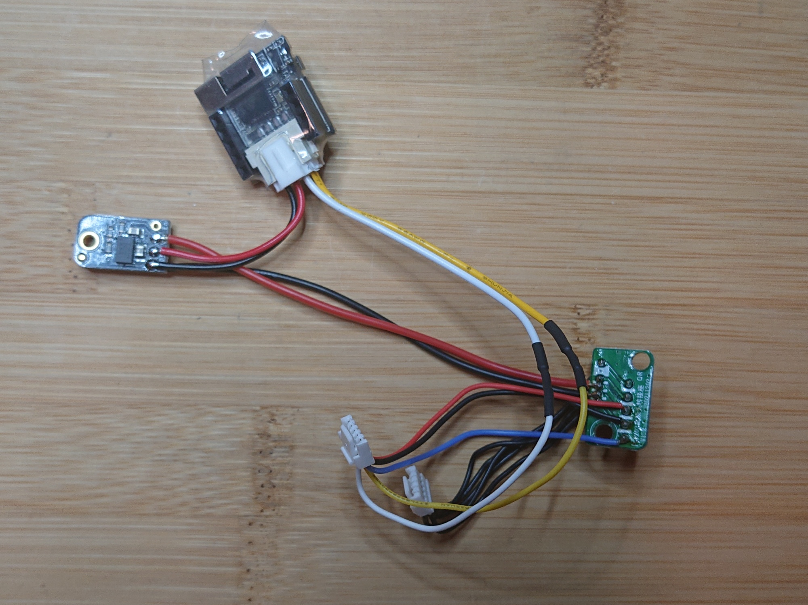

# mLRS Documentation: FlySky FRM303 Module #

([back to main page](../README.md))

The FlySky FRM303 transmitter module is a nearly perfect option for building mLRS equipment in the 2.4 GHz frequency range. Its main drawback is its price. It also has a small MCU which limits the available mLRS features. However, no hardware tweaking is required. Although mods, like the OLED mod and mLRS-WiFi-bridge addition, are possible. See bottom of the page for more about optional modifications.

<table>
  <tbody>
    <tr>
      <td>Frequency Band</td>
      <td>2.4 GHz</td>
    </tr>
    <tr>
      <td>Max. RF Output Power</td>
      <td>+30 dBm (1 W). The hardware should be capable of +33 dBm (2 W) but current mLRS firmware does not provide this option.</td>
    </tr>
    <tr>
      <td>Supported Modes</td>
      <td>50 Hz, 31 Hz, 19 Hz</td>
    </tr>
    <tr>
      <td>Weight</td>
      <td>65 grams without antenna</td>
    </tr>
  </tbody>
</table>

**Important: Never power up without an antenna connected! Otherwise you risk damaging the RF section.**

- [Product Page](https://www.flysky-cn.com/frm303description)

## As Tx Module ##

The description is for the default firmware version ('USB' version, indicated by a '-usb' label in the firmware file name).

The FRM303 provides two connectors, a 5-pin JST-GH connector at the bottom edge and a USB-C connector at top edge. In addition there is a 5-way button. Their usage is as follows:

JST-GH connector:

USB-C connector:

- com/cli port

5-way button:

- bind button (to enter bind mode, hold the button in the down direction for ca 4 seconds)

Notes:

- To enter the system bootloader for flashing, hold the button in the down direction during power up (or use the CLI, Lua script, or OLED if available)

## As Receiver ##

JST-GH connector:

USB-C connector:

- no function (except for firmware upgrade)

5-way button:

- bind button (to enter bind mode, hold the button in the down direction for ca 4 seconds)

Notes:

- To enter the system bootloader for flashing, hold the button in the down direction during power up
- The flight controller may not provide enough power for the FRM303 to run properly, choose a proper power source

## Flashing ##

### Initial Flashing ###

The first time that you flash the mLRS firmware to a FRM303 module you'll have to do the following:

- Download and install [STM32CubeProgrammer](https://www.st.com/en/development-tools/stm32cubeprog.html)
- Connect your ST-Link programmer to the 3V3, GND, SWD, and SWCLK pins on the board
    - You need to remove the bottom part of the case to gain access to these pins
    - Some ST-Link programmer boards provide power and some do not - ensure the FRM303 is powered
- Launch STM32CubeProgrammer and select ST-Link as the connection method, click connect
- From the menu on the left select the Erase & Programming tile
- Click 'Full chip erase'
- From the menu on the left select the Download tile
- Select the correct firmware in the Download section, click Start Program
- Power cycle the board, the LEDs should start blinking

Note: If you are unable to to flash due to readout protection, perform the following steps after connecting to the device:
- From the menu on the left select the OB (Option Bytes) tile
- From the Read Out Protection section, change to AA, select Apply
    - This will erase the current firmware

### Subsequent Flashing ###

Subsequent flashing can be done in two ways:
1. Follow the initial flashing process using the ST-Link programmer
2. Boot into the system bootloader using the boot button, CLI, Lua script or the OLED display if available
    - This enables programming over the USB-C port using the DFU method
    - Launch STM32CubeProgrammer and select USB as the connection method, click connect 
    - Proceed as usual

## Optional Modifications ##

### OLED Display Addition ###

The FRM303 Tx module can be optionally equipped with a 0.96" monochrome OLED screen (128x64 pixel, SSD1306 display controller, needs I2C bus and +3.3V power supply). With the OLED, among other functions, the current link statistics data can be observed, the parameter settings of the Tx module, as well as those of a connected receiver can be altered. User interface navigation is via the 5-way joystick. The OLED can replace the CLI and the mLRS Lua script.

To activate OLED screen, the "OLED" firmware version (indicated by a '-oled' label in the firmware file name) needs to be flashed into the Tx module. Please do also note that with FRM303 OLED firmware, presently the USB/CLI functionality will not be available, nevertheless for updating the firmware, DFU flashing still works.

The OLED mod exploits the fact that the FRM303 module has four M2.5 threads on the front side, where the top two holes provide easy access to the interior of the housing and the bottom two holes almost perfectly match the distance of the mounting holes of a typical 0.96" OLED display (the OLED mounting holes need also to be slightly enlarged to fit the M2.5 screws).

The following pictures illustrate a most simple application (click on the picture to open a bigger version):

 
 
 

 

Optionally, you can also build a housing for the OLED screen. You can find STL files to 3D print a mount and a cap for the OLED display under [docs/files/FRM303*.stl](./files). During testing it was found that various OLED displays have slightly different position of the visible area. To better match various OLED manufacturers and their tolerances, there are 3 options to choose from. Pick a file most suitable to your OLED display visible area location. The following overlay-composition of the 3 options depicts their difference in the opening area of the display:

Here the additional steps illustrated (click on the picture to open a bigger version):  
 
 
 
 

### mLRS-WiFi-bridge Addition ###

With [mLRS-WiFi-bridge](https://github.com/olliw42/mLRS/tree/main/esp/mlrs-wifi-bridge) mod, you will be able to stream the serial MAVLink data from the FRM303 to a WiFi capable device, such as a computer, a tablet or a smartphone and use software such as [Mission Planner](https://ardupilot.org/planner/) to evaluate telemetry data or adjust flight controller parameters on the fly.

Flysky FRM303 micro-JR bay adapter is spacious enough to hold an ESP32 module, such as the [M5Stack ATOM Lite](https://shop.m5stack.com/products/atom-lite-esp32-development-kit), together with a 5V regulator, such as the [Adafruit MPM3610 5V](https://www.adafruit.com/product/4739). The result is a tidy and compact solution:

Wiring diagram:

Following couple of pictures show the assembly process into the Flysky FRM303 micro-JR bay adapter (click on the picture to open a bigger version):

 
 
 

