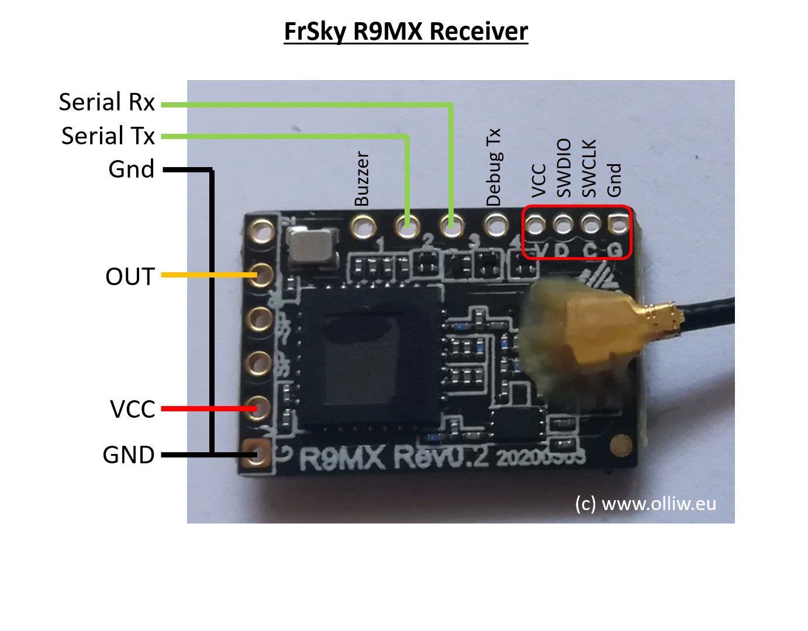

# mLRS Documentation: Frsky R9M, R9MX #

([back to main page](../README.md))

The Frsky R9M transmitter module and R9MM and R9MX receivers are commercially available and hence can be a relatively easy way to get started with mLRS. However, the R9 hardware does have some limitations as detailed below which may affect some applications.

<table>
  <tbody>
    <tr>
      <td>Frequency Bands</td>
      <td>868 MHz/915 MHz</td>
    </tr>
    <tr>
      <td>Max. RF Output Power</td>
      <td>30 dBm (1 W) for R9M, 17 dBm (50 mW) for R9MX, R9MM</td>
    </tr>
    <tr>
      <td>Supported Modes</td>
      <td>19 Hz</td>
    </tr>
  </tbody>
</table>

Note that R9 hardware can't connect with the other mLRS boards which support 868/915 MHz. This is because it uses the SX127x LoRa chipset, which happens to be incompatible with the newer SX126x LoRa chipset when the SF6 spreading factor used by the mLRS 19 Hz mode is selected.  The older chipset also doesn't support SF5 which is required for the mLRS 31 Hz mode.

## R9M Tx Module ##

The R9M transmitter module is somewhat limited with respect to serial ports. It provides access to only one serial port, which moreover has inverted TTL signals. In order to use this serial port, these conditions apply:

1. The serial port of the R9M module can be configured to work either as "serial" or "CLI". This is done by setting the dip switch 1 (left dip switch): off (switch down) = CLI, on (switch up) = serial. Note that the dip switch position is read only at power up, i.e., one needs to re-power the module to make any change effective.

2. One needs to somehow (un)invert the serial signals for most uses. You can buy or build a "Frsky inverter" dongle to connect a standard serial adapter.

3. If you use the mLRS Lua configuration script for configuration and thus don't need the CLI for configuration, you can avoid the inverter dongle when you use one of the supported ESP32 boards with the mlrs-wifi-bridge sketch to connect via MAVLink wirelessly to a Ground Control Station.  The ESP32 can directly use the inverted serial signals.

4. If you have the older 2018, "ACCST" version of the R9M, you will want to perform the Inverter Mod to allow reliable communication with the radio at higher bit rates.  This is nicely documented in the [ExpressLRS documentation](https://www.expresslrs.org/hardware/inverter-mod/).  Note that the newer 2019, "ACCESS" version of the R9M does not need this modification.

### DIY Inverter Dongle ###

There are several DIY approaches for building an inverter dongle. A common approach is based on the MAX3232 RS232 chip; an excellent build tutorial is provided here [Some soldering required](https://discuss.ardupilot.org/t/some-soldering-required/27613). Be aware however that many fake chips are available, and the original scheme suggested in this blog may not work. One, in fact, may have to two extra diodes and a resistor.

### ESP32 WiFi Bridge ###

The mLRS git repository includes an Arduino sketch which allows several supported ESP32 boards to be used as a WiFi Bridge to connect the serial port to any of the many available GCS such as Mission Planner or QGroundControl.  This approach can also eliminate the need for a separate inverter dongle.  Two of these boards, the M5Stamp Pico Mate and the M5Stamp C3U Mate from M5Stack allow pin layouts which are especially convenient to connect directly to the serial pins on the R9M Tx module.  The [M5Stamp C3U Mate](https://shop.m5stack.com/collections/m5-controllers/products/m5stamp-c3u-mate-with-pin-headers) is the easiest option as it can be flashed via its included USB port rather than requiring a separate programmer.  The 2.4 GHz WiFi bridge works especially well with 900 MHz systems like the R9 since the separate frequency range minimizes interference.

To install the sketch on the M5Stamp C3U Mate, use the Arduino IDE.  Open the mlrs-wifi-bridge.ino sketch from the mLRS esp/mlrs-wifi-bridge folder, edit the mlrs-wifi-bridge.ino file to uncomment only the MODULE\_M5STAMP\_C3U\_MATE\_FOR\_FRSKY\_R9M define, select the ESP32C3 Dev board in the IDE, connect the M5Stamp C3U Mate module USB connector to your computer while holding down the center button, and upload the sketch via the IDE.

__Be sure to unplug the M5Stamp C3U Mate from the back of the R9M when programming via USB to avoid feeding 5 volt power back to R9M which might cause damage.__

Connecting the M5Stamp C3U Mate to the R9M is easy:  Remove the screw and the plastic cover.  Cut a 5 pin length of the included pin header female connector and pull out the pin from the last position.  This position serves as a key to avoid plugging in the board incorrectly.  Solder the pins in the thru holes as shown below (key position hanging over the left) and reinstall the plastic cover.  After programming the sketch, install on the back of the R9M as shown above.  Then, you can connect your GCS computer or mobile device to the "mLRS AP UDP" WiFi access point and connect the GCS via UDP on port 14550.

### Cooling ###

With mLRS the R9M module will require active cooling when running at power levels above 500 mW, but cooling might be advisable also at lower powers, at 500 mW or even 250 mW.  Note, however, that there is little point running the transmitter at high power levels if you are using one of the low-power Frsky receivers.

A description for installing a fan along with documentation for 3D printed case covers with fan mount can be found here https://www.expresslrs.org/2.0/hardware/fan-mod/. Note: The PB9 mechanism described there to control the fan is available with mLRS too.

### As Receiver ###

The R9M module can also be flashed with firmware which allows it to be used as mLRS receiver. This yields a receiver working at high transmit power for longer range applications. For details please search the rcgroups thread and ask on rcgroups or discord if you have questions.

## R9MX Receiver ##

The R9MX receiver is a good choice for mLRS. The transmit power may however be somewhat low for applications aiming for largest range.

The thru-hole pads for Serial Wire Debug make it easy to connect ST-Link via a connector or micro-hook clips.

| Pin | Use
| --- | ---
| Pin 1 GND | Ground
| Pin 2 VIN | Power 3.5-10V
| Pin 5 SBUS OUT | RC Output
| CH1 | Buzzer
| CH2 | Serial Tx
| CH3 | Serial Rx
| CH4 | Debug Tx

### As Tx Module ###

The R9MX receiver can also be used as mLRS Tx module. Due to hardware restrictions it is somewhat limited but can be a great choice for special applications. 

The module can be configured via CLI only. The CLI shares the same port used for serial/Mavlink communication. Switching between CLI and serial port is done via the bind button:
- Powering up the R9MX without holding down the bind button will boot in "Serial" mode. To enter CLI mode, press the bind button while powering up or shortly after powering up if using the ELRS bootloader. The device then runs in CLI mode, and can be configured as usual via CLI commands.

The wiring is similar to when used as a receiver, with the exception that the "Inverted SPort" pin (original naming) is available as input port.

## R9MM Receiver ##

The R9MM receiver is also supported. However, flashing the R9MM with ST-Link is tedious and requires top soldering skills or employing other tricks, as one needs to connect to four tiny solder pads in a tight space. If you want to flash via ST-Link, please consider using the R9MX receiver instead.

If you want to use ELRS bootloader and install via the Frsky bootloader and OpenTX or EdgeTX, the R9MM is the smallest and lightest receiver available.  Note: The R9MM has a different [wiring diagram](https://www.expresslrs.org/quick-start/receivers/r9/#wiring-up-your-receiver) than the R9MX.

## Flashing ##

The mLRS firmware must, of course, be flashed on both the Tx module and the receiver before it can be used.

### Acknowledgments ###

We wish to express our thanks to the folks of the ExpressLRS project, who have worked out the easy way to flash the R9 hardware, which is now also available for mLRS. With gratitude, here we are utilizing the ExpressLRS bootloader images and scripts and, in several cases, also their excellent documentation.

### Flash the R9M with ELRS bootloader ###

You can flash the ELRS bootloader and mLRS using your radio with OpenTX 2.3.12 or newer or EdgeTX 2.4.0 or newer.  This method is especially recommended for new users.

Of course, flashing via ST-Link is also still an option.

The ExpressLRS documentation provides ELRS specific instructions [here](https://www.expresslrs.org/quick-start/transmitters/frsky-r9modules/#via-stock_bl) which you might want to reference if the instructions here are not clear.  Of course, you should ignore the references to the ELRS configurator and build mLRS as instructed elsewhere.

#### Flash the ELRS bootloader ####

These steps only need to be performed once.  If you experience a "No Sync" error, check that you have selected CRSF external mode and not mBridge.

If you have never previously flashed this module via ST-Link, you can use the stock Frsky bootloader to flash the ELRS bootloader alongside the stock bootloader.  This method will preserve the ability to return to the stock Frsky firmware.

1. Download the [r9m\_elrs\_bl.frk](https://github.com/ExpressLRS/ExpressLRS/blob/master/src/bootloader/r9m_elrs_bl.frk?raw=true) file from the ExpressLRS git repository and copy it to the FIRMWARE folder on your radio's SD card.

2. Install the R9M module in your radio and power it on.

3. Enter the System Menu and navigate using the page buttons to the SD card page.

4. Scroll to the FIRMWARE folder and select the r9m\_elrs\_bl.frk file.  Choose "Flash external module".

5. Follow the instructions in the next section to flash mLRS.

If you have already flashed via ST-Link, you can continue to flash updates via ST-Link the way you always have, or you can follow these steps to switch to flashing from the radio.  To do this, you will flash the ELRS bootloader by using ST-Link one last time:

1. Download the [r9m\_bootloader.bin](https://github.com/ExpressLRS/ExpressLRS/blob/master/src/bootloader/r9m_bootloader.bin?raw=true) file from the ExpressLRS git repository.
2. Flash it to the beginning of the flash (0x8000000) using ST-Link and STM32CubeProgrammer.

3. Follow the instructions in the next section to flash mLRS.

#### Flash/Update the mLRS firmware ####

Once the ELRS bootloader is installed, the following precedure can be followed to install the mLRS firmware.

1. Download the latest mLRS firmware or build with MLRS\_FEATURE\_ELRS\_BOOTLOADER defined.

2. Copy the latest tx-R9M-f103c8-elrs-bl-r9m-v*.elrs file to FIRMWARE folder on your radio's SD card.

3. Enter the System Menu and navigate using the page buttons to the SD card page.

4. Select the FIRMWARE folder and scroll to and select the tx-R9M-f103c8-elrs-bl-r9m-v*.elrs file.  Choose "Flash external ELRS".

### Flash R9 receivers with ELRS bootloader ###

#### Flash the ELRS bootloader ####

Wiring the receiver to the JR Bay on the back of your radio and flashing the ELRS bootloader is documented [here](https://www.expresslrs.org/quick-start/receivers/r9/).  The procedure is similar to flashing the R9M as described above in the First time bootloader install section.  Use the appropriate .frk file indicated in the ELRS instructions for the receiver you are flashing.  Flashing the ELRS bootloader from the .frk file only needs to be done once.

#### Flash/Update the mLRS firmware ####

After flashing the ELRS bootloader, you can connect the serial port as described in the link above and use the ELRS UARTupload.py script to flash/update mLRS with latest mLRS firmware .elrs file.  There are, of course, separate .elrs image files for each receiver:

1. Download the latest mLRS firmware or build with MLRS\_FEATURE\_ELRS\_BOOTLOADER defined.

2. Download or git clone the [ExpressLRS](https://github.com/ExpressLRS/ExpressLRS) repository.  Since you only need the src/python folder, if you have subversion installed, you could use the svn github interface to get just what you need.  From the command line type something like this: "svn export https://github.com/ExpressLRS/ExpressLRS/trunk/src/python"

3. Connect a TTL USB serial adapter to your computer and install a driver if it's not recognized.  If you don't have a TTL USB serial adapter, you should be able to use your flight controller.  See step 8

4. Wire the serial adapter to your receiver as instructed [here](https://www.expresslrs.org/quick-start/receivers/r9/#wiring-up-your-receiver).  But, don't connect the VCC wire yet.

5. Use the command window to run the UARTupload.py script like: "python UARTupload.py image\_file\_path" where image\_file\_path is the path to the appropriate .elrs file you obtained in step 1.

6. When the python script reports "attempting to reboot into bootloader", power up the receiver by connecting the VCC wire to the 5 volt output of your serial adapter or a 5 volt power supply.  You should see the script report sync and begin the firmware download.  If it fails, try again, the timing can be a bit tight.  The first time you flash the .elrs file, you may not need to delay connecting the VCC wire.  If you have trouble getting the timing correct, you can hold down the button when powering up the receiver and the ELRC bootloader will keep running and not start the application code.

7. When the UARTupload.py script reports the flash was successful, you can leave the receiver powered by the serial adapter and try to establish a connection from your TX.  The LED will switch from rapid red to 1Hz green on both the RX and TX when the connection is established.

8. After you have connected the receiver serial port to your flight controller and installed it in your build, you can use Ardupilot's [serial passthrough](https://ardupilot.org/copter/docs/common-serial-passthrough.html) feature for future mLRS firmware updates without uninstalling the receiver from your build.  The baud rate for the FC serial port used should be configured for 420,000 in Ardupilot.  The receiver should be powered up (battery connected) after the UARTupload.py script reports "attempting to reboot into bootloader" as in step 6.  This is most easily accomplished by wiring the receiver to a regulated power output on your flight controller or ESC which is active only when the battery is connected, but not powered when the flight controller is connected to USB without the battery.  If this can't easily be arranged, you will have to hold down the receiver button when connecting the flight controller USB port.

### Flash/Update via ST-Link ###

Note: Flashing any Frsky R9 board with the ST-Link is a non-reversible operation, i.e., it is not possible to revert back to the original Frsky firmware. It is possible to switch to ExpressLRS however.

The ST-Link connection is made as described in the ExpressLRS docs:
- R9M module: https://www.expresslrs.org/1.0/quick-start/tx-r9m/#flashing-using-stlink
- R9MX receiver: https://www.expresslrs.org/1.0/quick-start/rx-stlink/

In these docs it is suggested to download and use the "ST-LINK Utility" software. This software is pretty outdated (NRND = not recommended for new designs), and the new recommended tool is "STM32CubeProgrammer".
