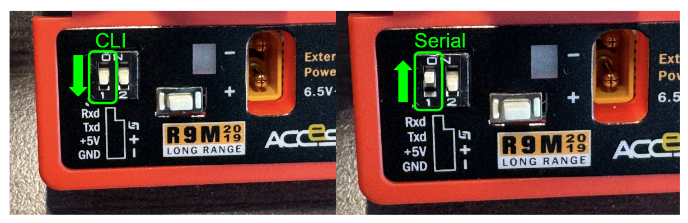
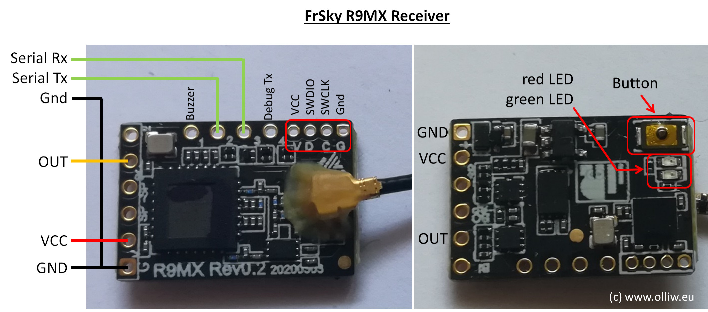

# mLRS Documentation: Frsky R9M, R9M Lite Pro, R9 MX #

([back to main page](../README.md))

Note: 868/915 R9 hardware cannot connect with 868/915 MHz mLRS hardware using the SX126x LoRa chipset (E5 Mini, E77 Easy Solder, E77 MBL). This is because the 868/915 MHz R9 hardware uses the SX127x LoRa chipset, which is incompatible with the SX126x LoRa chipset for the spreading factor used by the mLRS 19 Hz mode. In addition, the SX127x does not support the spreading factor which is used for the mLRS 31 Hz mode.

The Frsky R9M, R9M Lite Pro transmitter modules and R9 MX, R9 MM, R9 Mini receivers can be a relatively easy way to get started with mLRS as they are commercially available. However, the R9 hardware does have some limitations as detailed below which may affect some applications.

<table>
  <tbody>
    <tr>
      <td>Frequency Bands</td>
      <td>868 MHz/915 MHz</td>
    </tr>
    <tr>
      <td>Max. RF Output Power</td>
      <td>30 dBm (1 W) for R9M, R9M Lite Pro, 17 dBm (50 mW) for R9 MX, R9 MM, R9 Mini</td>
    </tr>
    <tr>
      <td>Supported Modes</td>
      <td>19 Hz</td>
    </tr>
  </tbody>
</table>

## R9M Tx Module ##

The R9M transmitter module is a great option given its 1 W transmit power but is somewhat limited with respect to serial ports. It provides access to only one serial port, which moreover has inverted TTL signals. In order to use this serial port, these conditions apply:

1. The serial port of the R9M module can be configured to work either as "serial" or "CLI". This is done by setting the dip switch 1 (left dip switch): off (switch down) = CLI, on (switch up) = serial. Note that the dip switch position is read only at power up, i.e., one needs to re-power the module to make any change effective.  Refer to the photo below:

2. Dealing with the inverted TTL signals is best addressed by using a seperate ESP32 module connected to the serial port as the ESP32 supports inverted TTL signals. The mlrs-wireless-bridge sketch will allow one to connect a Ground Control Station wirelessly via MAVLink. Additionally, the CLI can be accessed with common terminal programs when using the mlrs-wireless-bridge sketch in Bluetooth Classic mode.  For ESP32 modules that do not support Bluetooth Classic (C3, C6 and S3 variants) one can configure the sketch for TCP and use telnet on Linux or Windows or another TCP terminal App on Mobile devices.  You may need to map received CR characters to CR+LF.  If you use telnet, you can do this by typing the escape sequence which is shown when you start telnet and then type "toggle crmod".

3. Another option is to use a software tool to reconfigure FTDI based serial adapters, to have inverted RX/TX.

4. Alternatively, you can buy or build a "Frsky inverter" dongle to connect a standard serial adapter.

Connections:

4-Pin Header (from top to bottom):

| Pin | Use
| --- | ---
| Pin 1 | Inverted serial Rx
| Pin 2 | Inverted serial Tx
| Pin 3 VCC | 5 V
| Pin 4 GND | Ground

### R9M Versions ###

Frsky updated the R9 system a year after introducing it, so there are two versions of the Tx Module. Both versions can run the same mLRS firmware, but the newer version included some small hardware improvements.

If you have the older 2018, "ACCST" version of the R9M, you will want to perform the Inverter Mod to allow reliable communication with the radio at higher bit rates. This is nicely documented in the [ExpressLRS documentation](https://www.expresslrs.org/hardware/inverter-mod/).  The newer 2019, "ACCESS" version of the R9M does not need this modification.

### DIY Inverter Dongle ###

There are several DIY approaches for building an inverter dongle. A common approach is based on the MAX3232 RS232 chip; an excellent build tutorial is provided here [Some soldering required](https://discuss.ardupilot.org/t/some-soldering-required/27613). Be aware however that many fake chips are available, and the original scheme suggested in this blog may not work. One, in fact, may have to add two extra diodes and a resistor.

### Invert RX/TX on FTDI Serial Adapter ###

This may not work on all versions of this adapter, many have non-genuine chips. Using the FT_prog tool it is simple to reconfigure these common serial adapters so that the RX and TX use inverted logic. The tool can be downloaded [here](https://ftdichip.com/utilities/#ft_prog). Instructions on using the tool can be [found on GitHub](https://github.com/kaack/elrs-joystick-control?tab=readme-ov-file#configuring-the-ftdi-adapter). 

Note: Do not connect the 5V pin! Only connect Gnd, RX, and TX.

### ESP32 Wireless Bridge ###

The mLRS git repository includes an Arduino sketch which allows several supported ESP32 boards to be used as a wireless bridge to connect the serial port to any of the many available GCS such as Mission Planner or QGroundControl. This approach can also eliminate the need for a separate inverter dongle.  Two of these boards, the M5Stamp Pico Mate and the M5Stamp C3U Mate from M5Stack allow pin layouts which are especially convenient to connect directly to the serial pins on the R9M Tx module.  The [M5Stamp C3U Mate](https://shop.m5stack.com/collections/m5-controllers/products/m5stamp-c3u-mate-with-pin-headers) is the easiest option as it can be flashed via its included USB port and does not require a separate programmer. However, it does not support Bluetooth Classic. If you want to use Bluetooth to connect to your GCS, then the [M5Stamp Pico Mate](https://shop.m5stack.com/products/m5stamp-pico-diy-kit) is the recommended choice. Both of these modules use the 2.4 GHz band for the wireless bridge and will work well with 868/915 MHz systems like the R9 as the separate frequency range minimizes interference.

Connecting the M5Stamp C3U Mate or Pico Mate to the R9M is easy: Remove the M5Stamp module's screw and plastic cover. Cut a 5 pin length of the included pin header female connector and pull out the pin from the last position. This position serves as a key to avoid plugging in the board incorrectly. Solder the pins in the thru holes as shown below (key position hanging over the left) and reinstall the plastic cover.  After programming the sketch, install on the back of the R9M as shown above. Then, you can connect your GCS computer or mobile device to the "mLRS AP UDP" WiFi access point and connect the GCS via UDP on port 14550.

To install the sketch on the M5Stamp C3U Mate, use the Arduino IDE. Open the mlrs-wireless-bridge.ino sketch from the mLRS esp/mlrs-wireless-bridge folder, edit the mlrs-wireless-bridge.ino file to uncomment only the MODULE\_M5STAMP\_C3U\_MATE\_FOR\_FRSKY\_R9M define, select the ESP32C3 Dev board in the IDE, connect the M5Stamp C3U Mate module USB connector to your computer while holding down the center button, and upload the sketch via the IDE.

__Be sure to unplug the M5Stamp C3U Mate from the back of the R9M when programming via USB to avoid feeding 5 volt power back to R9M which might cause damage.__

If you use the M5Stamp Pico Mate, you can select the Bluetooth protocol when you edit the mlrs-wireless-bridge.ino file and then you can connect your GCS via Bluetooth.  The Bluetooth option can be very convenient, especially in cases where WiFi might be used for an Internet connection on your GCS computer or device.

Programming the Pico Mate is fairly easy using a USB TTL serial adapter which supports the DTR and RTS pins.  The adapter which comes with the [M5Stamp Pico DIY Kit](https://shop.m5stack.com/products/m5stamp-pico-diy-kit) may be the most convenient and the kit includes the Pico Mate module.  You can solder the 6 pin female header connector to the appropriate pins on the module and plug the kit's serial adapter directly (recommended).  Or, if you prefer to leave off the programming connector, it is possible to insert the serial adapter pins into the appropriate thru-holes on the module and hold it in place with some pressure at an angle so as to to ensure continuous contact with all 6 pins during the programming process.

### Cooling ###

With mLRS the R9M module will require active cooling when running at power levels above 500 mW, but cooling might be advisable also at lower powers, at 500 mW or even 250 mW. Note, however, that there is little point running the transmitter at high power levels if you are using one of the low-power Frsky receivers.

A description for installing a fan along with documentation for 3D printed case covers with fan mount can be found here https://www.expresslrs.org/2.0/hardware/fan-mod/. Note: The PB9 mechanism described there to control the fan is available with mLRS too.

### As Receiver ###

The R9M module can also be used as an mLRS receiver, this yields a receiver with high transmit power for long range applications. The R9M Lite Pro might be a better option however.

Connections:

4-Pin Header (from top to bottom):

| Pin | Use
| --- | ---
| Pin 1 | Inverted serial Rx
| Pin 2 | Inverted serial Tx
| Pin 3 VCC | 5 V
| Pin 4 GND | Ground

Note: As the serial connection is inverted, this will have to be accounted for when connecting to the flight controller. One solution is to use an inverter cable as mentioned above. Alternatively, ArduPilot F7 and H7 based flight controllers have built-in inverters which can be enabled using with the SERIALx_OPTIONS parameter.

JR Bay connector:

| Pin | Use
| --- | ---
| Pin 1 | not used
| Pin 2 | not used
| Pin 3 VBAT | Power 2S
| Pin 4 GND | Ground
| Pin 5 SPort | Out (SBus only)

## R9M Lite Pro as Receiver ##

The R9M Lite Pro transmitter module could be used as mLRS Tx module but it is not well suited for this. It can however be a great option as mLRS receiver, providing 1 W transmit power and hence excellent range in combination with a R9M Tx module.

The R9M Lite Pro has no button therefore the power cycle method has to be used for binding (see [here](BINDING.md)).

| Pin | Use
| --- | ---
| Pin 1 | Out (CRSF, SBus, inv. SBus supported)
| Pin 2 GND | Ground
| Pin 3 VBAT | Power 2S
| Pin 5 | Serial Rx
| Pin 6 | Serial Tx

### R9M Lite Pro Versions ###

The hardware of the R9M Lite Pro appears to have been modified over time. mLRS works with version v1.5 2021/7/8. Unfortunately it appears to not be easily possible to determine the hardware version from vendor descriptions or from the device's case. It is likely that the mLRS code will work fine also with older hardware versions, but this has not been tested.

## R9 MX Receiver ##

The R9 MX receiver is a good choice for mLRS. The transmit power may however be somewhat low for applications aiming for largest range.

The thru-hole pads for Serial Wire Debug make it easy to connect ST-Link via a connector or micro-hook clips.

| Pin | Use
| --- | ---
| Pin 1 GND | Ground
| Pin 2 VIN | Power 3.5 - 10 V
| Pin 5 SBUS OUT | Out (CRSF, SBus, inv. SBus supported)
| CH1 | Buzzer
| CH2 | Serial Tx
| CH3 | Serial Rx
| CH4 | Debug Tx

Button:
- press for ca 4 sec to enter bind mode
- press during power up to enter system bootloader for firmware upgrade

### As Tx Module ###

The R9 MX receiver can also be used as mLRS Tx module. Due to hardware restrictions it is somewhat limited but can be a great choice for special applications.

The module can be configured via CLI only. The CLI shares the same port used for serial/Mavlink communication. Switching between CLI and serial port is done via the bind button:
- Powering up the R9 MX without holding down the bind button will boot in "Serial" mode. To enter CLI mode, press the bind button while powering up or shortly after powering up if using the ELRS bootloader. The device then runs in CLI mode, and can be configured as usual via CLI commands.

The wiring is similar to when used as a receiver, with the exception that the "Inverted SPort" pin (original naming) is available as input port.

## R9 MM / R9 Mini Receiver ##

The R9 MM and R9 Mini receivers are supported, however, flashing with ST-Link is tedious and requires top soldering skills or employing other tricks, as one needs to connect to four tiny solder pads in a tight space. If you want to flash via ST-Link, please consider using the R9 MX receiver instead.

If you want to use ELRS bootloader and install via the Frsky bootloader and OpenTX or EdgeTX, the R9 MM / R9 Mini is the smallest and lightest receiver available.

| Pin | Use
| --- | ---
| Pin 2 VIN | Power 3.5 - 10 V
| Pin 3 GND | Ground
| Pin 5 SBUS OUT | Out (SBus only)
| CH1 | Buzzer
| CH2 | Debug Tx
| CH3 | Serial Tx
| CH4 | Serial Rx

Button:
- press for ca 4 sec to enter bind mode
- press during power up to enter system bootloader for firmware upgrade

## Flashing ##

The mLRS firmware must be flashed on both the Tx module and the receiver before they can be used. For flashing, as well as upgrading, several methods are available: via ExpressLRS bootloader, via ST-Link/SWD, or via system bootloader. The methods are each described in the following. 

Note: The R9M Lite Pro can only be flashed/upgraded using the ST-Link method.

### Acknowledgments ###

We wish to express our thanks to the folks of the ExpressLRS project, who have worked out the easy way to flash the R9 hardware, which is now also available for mLRS. With gratitude, here we are utilizing the ExpressLRS bootloader images and scripts and, in some cases, also their excellent documentation.

### Flash the R9M Module with ELRS Bootloader ###

You can flash the ELRS bootloader and the mLRS firmware to the R9M module using your radio with OpenTX 2.3.12 or newer or EdgeTX 2.4.0 or newer. This method is especially recommended for new users.

Of course, flashing via ST-Link is also still an option.

The ExpressLRS documentation provides ELRS specific instructions [here](https://www.expresslrs.org/quick-start/transmitters/frsky-r9modules/#via-stock_bl) which you might want to reference if the instructions here are not clear. Of course, you should ignore the references to the ELRS configurator and build mLRS as instructed elsewhere.

#### Flash the ELRS Bootloader ####

These steps only need to be performed once. If you experience a "No Sync" error, check that you have selected CRSF (with 400k baud) external mode in the radio.

If you have never previously flashed the R9M module via ST-Link, you can use the stock Frsky bootloader to flash the ELRS bootloader alongside the stock bootloader. This method will preserve the ability to return to the stock Frsky firmware.

1. Download the [r9m\_elrs\_bl.frk](https://github.com/ExpressLRS/ExpressLRS/blob/master/src/bootloader/r9m_elrs_bl.frk?raw=true) file from the ExpressLRS git repository and copy it to the FIRMWARE folder on your radio's SD card.

2. Install the R9M module in your radio and power it on.

3. Enter the System Menu and navigate using the page buttons to the SD card page.

4. Scroll to the FIRMWARE folder and select the r9m\_elrs\_bl.frk file. Choose "Flash external module".

5. Follow the instructions in the next section to flash the mLRS firmware.

If you have already flashed via ST-Link, you can continue to flash updates via ST-Link the way you always have, or you can follow these steps to switch to flashing from the radio. To do this, you will flash the ELRS bootloader by using ST-Link one last time:

1. Download the [r9m\_bootloader.bin](https://github.com/ExpressLRS/ExpressLRS/blob/master/src/bootloader/r9m_bootloader.bin?raw=true) file from the ExpressLRS git repository.

2. Flash it to the beginning of the flash (0x8000000) using ST-Link and STM32CubeProgrammer.

3. Follow the instructions in the next section to flash the mLRS firmware.

#### Flash/Update the mLRS Firmware ####

Once the ELRS bootloader is installed, the following precedure can be followed to install the mLRS firmware.

1. Download the latest mLRS firmware, or build with MLRS\_FEATURE\_ELRS\_BOOTLOADER defined.

2. Copy the latest tx-R9M-f103c8-elrs-bl-v*.elrs file to FIRMWARE folder on your radio's SD card. Note the "elrs-bl" in the file name.
   - Note: On bw radios it can be necessary to rename the firmware file to a shorter file name.

3. Enter the System Menu and navigate using the page buttons to the SD card page.

4. Select the FIRMWARE folder and scroll to and select the tx-R9M-f103c8-elrs-bl-v*.elrs file. Choose "Flash external ELRS".

### Flash R9 Receivers with ELRS Bootloader ###

#### Flash the ELRS Bootloader ####

Wiring the receiver to the JR Bay on the back of your radio and flashing the ELRS bootloader is documented [here](https://www.expresslrs.org/quick-start/receivers/r9/). The procedure is similar to flashing the R9M module as described above in the bootloader install section. Use the appropriate .frk file indicated in the ELRS instructions for the receiver you are flashing. Flashing the ELRS bootloader from the .frk file only needs to be done once.

#### Flash/Update the mLRS Firmware ####

After flashing the ELRS bootloader, you can connect the receiver's serial port as described in the link above and use the ELRS UARTupload.py script to flash/update the latest mLRS firmware .elrs file. There are, of course, separate .elrs image files for each receiver.

Note: Python3 is a prerequisite to use the ELRS UARTUpload.py script.

1. Download the latest mLRS firmware, or build with MLRS\_FEATURE\_ELRS\_BOOTLOADER defined.

2. Download or git clone the [ExpressLRS](https://github.com/ExpressLRS/ExpressLRS) repository.
    - If you have subversion installed: Since you only need the src/python folder, you could use the svn github interface to get just what you need. From the command line type something like this: "svn export https://github.com/ExpressLRS/ExpressLRS/tree/master/src/python"

3. Connect a USB-TTL serial adapter to your computer and install a driver if it is not recognized.  
    - Note: If you are having trouble flashing and are using a CP210X adapter, please try a different USB-TTL adapter. If you continue to have problems or don't have a USB-TTL serial adapter, you should be able to use your flight controller instead - see step 8.

4. Wire the USB-TTL serial adapter to your receiver as instructed [here](https://www.expresslrs.org/quick-start/receivers/r9/#wiring-up-your-receiver). But, don't connect the VCC wire yet.

5. Move the .elrs firmware file to the src/python folder downloaded in step 2. Open a command line processor and navigate to the src/python folder. Then execute the command 'python UARTupload.py XYZ.elrs' where XYZ is the .elrs firmware file for your hardware.
    - Note: If the upload fails by connecting to the wrong port, you can specify the appropriate port after the firmware filename, e.g. 'python UARTupload.py XYZ.elrs COM11'.

6. When the python script reports "attempting to reboot into bootloader", power up the receiver by connecting the VCC wire to the 5 Volt output of your USB-TTL serial adapter or a 5 Volt power supply. You should see the script report sync and begin the firmware download. If it fails, try again, the timing can be a bit tight. The first time you flash the .elrs file, you may not need to delay connecting the VCC wire. If you have trouble getting the timing correct, you can hold down the button when powering up the receiver to enter the ELRS bootloader. To confirm that you are in the bootloader you should see the red and green LEDs blink alternately on the receiver.

7. When the UARTupload.py script reports the flash was successful, you can leave the receiver powered by the USB-TTL serial adapter and try to establish a connection from your Tx module. The LED will switch from rapid red to 1 Hz green on both the receiver and Tx module when the connection is established.

8. After you have connected the receiver serial port to your flight controller and installed it in your build, you can use ArduPilot's [serial passthrough](https://ardupilot.org/copter/docs/common-serial-passthrough.html) feature for future mLRS firmware updates without uninstalling the receiver from your build. The baud rate for the FC serial port used should be configured for 420,000 in ArduPilot. The receiver should be powered up (battery connected) after the UARTupload.py script reports "attempting to reboot into bootloader" as in step 6. This is most easily accomplished by wiring the receiver to a regulated power output on your flight controller or ESC which is active only when the battery is connected, but not powered when the flight controller is connected to USB without the battery. If this cannot easily be arranged, you will have to hold down the receiver button when connecting the flight controller USB port.

### Flash/Update via ST-Link ###

Note: Flashing any Frsky R9 board with ST-Link is a non-reversible operation, i.e., it is not possible to revert back to the original Frsky firmware. It is possible to switch to ExpressLRS however.

The ST-Link connection is made as follows:
- R9M module: https://www.expresslrs.org/quick-start/transmitters/frsky-r9modules/#via-stlink
- R9 MX receiver: https://www.expresslrs.org/quick-start/receivers/r9/#via-stlink
- R9M Lite Pro module:

Use the non-"elrs-bl" firmware versions, which can be identified by the ".hex" extension and that the label "elrs-bl" is not contained in the firmware file name. 

Note: In the ExpressLRS docs it is suggested to download and use the "ST-LINK Utility" software. This software is pretty outdated (NRND = not recommended for new designs). Please use the new and recommended tool "STM32CubeProgrammer".

### Update via System Bootloader ###

When the R9 MX / R9 MM / R9 Mini receivers have been flashed with the non-"elrs-bl" firmware version via ST-Link, they can be upgraded by invoking the STM32 system bootloader, which can be done as follows:

- Download and install STM32CubeProgrammer.
- Connect the R9 MX / R9 MM / R9 Mini via the serial Rx/Tx pins to a USB-TTL adpater.
- Power up the R9 MX / R9 MM / R9 Mini while keeping the button pressed; this boots the receiver into the system bootloader.
- Launch STM32CubeProgrammer and select the Serial connection option as the connection method, click connect.
- From the menu on the left select the Download tile.
- Select the correct firmware in the Download section, click Start Program.
- Power cycle the board.
