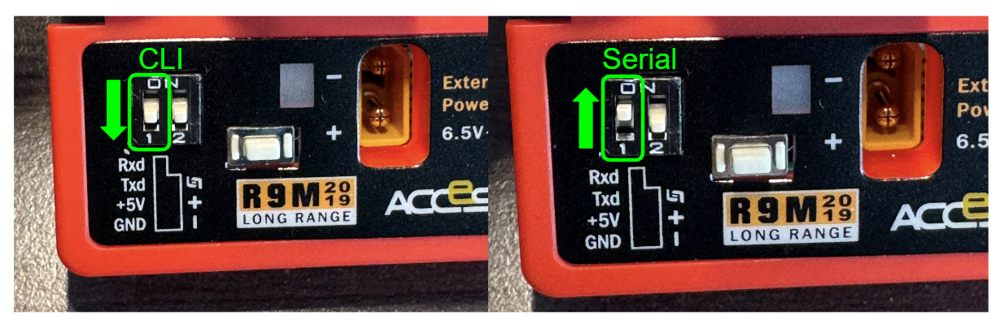
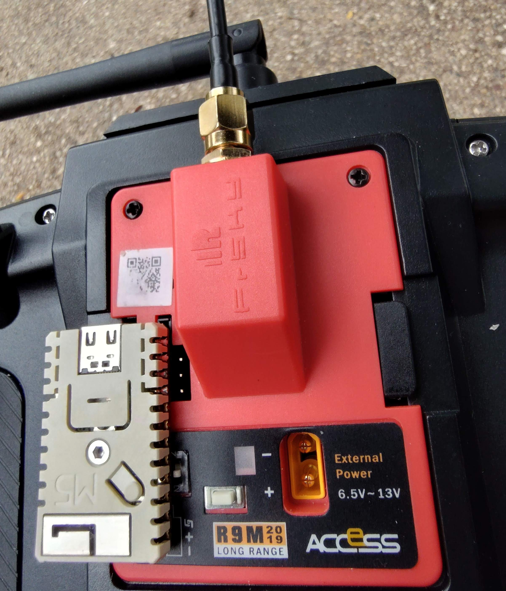
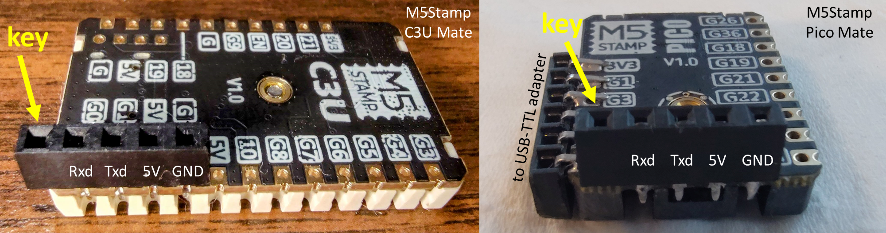

# mLRS Documentation: Frsky R9M Transmitter #

([back to main page](../README.md))

The Frsky R9M transmitter module is a a good choice for mLRS since it supports 1 W output power and is commercially available at an affordable price.

<table>
  <tbody>
    <tr>
      <td>Frequency Bands</td>
      <td>868 MHz/915 MHz</td>
    </tr>
    <tr>
      <td>Max. RF Output Power</td>
      <td>30 dBm (1 W)</td>
    </tr>
    <tr>
      <td>Supported Modes</td>
      <td>19 Hz</td>
    </tr>
  </tbody>
</table>

Note: The R9M module cannot connect with mLRS boards which support 868/915 MHz and use the SX126x LoRa chipset. This is because R9 hardware uses the SX127x LoRa chipset, which is incompatible with the SF6 spreading factor used by the mLRS 19 Hz mode. In addition, the SX127x does not support the SF5 spreading factor which is used for the mLRS 31 Hz mode. The R9M module is compatible with all ELRS 868/915 MHz receivers as they share the SX127x LoRa chipset.

## R9M Tx Module ##

Connections:

4-Pin Header (from top to bottom):

| Pin       | Use
| --------- | ---
| Pin 1 Rxd | Inverted serial Rx
| Pin 2 Txd | Inverted serial Tx
| Pin 3 +5V | 5 V
| Pin 4 GND | Ground

### Serial Port ###

The R9M module provides access to only one serial port, which has inverted TTL signals. 

As there is only one serial port, one can configure the serial port to be function either as "serial" or "CLI". This is done by changing the setting on dip switch 1, which is read at power up:
  - off (switch down) = CLI
  - on (switch up) = serial

- Dealing with the inverted TTL signals is best addressed by using an ESP32 module connected to the serial port to act as a wireless bridge. This is detailed below in the 'ESP32 Wireless Bridge' section. 

- If you prefer to use a wired connection instead, then the following options are available:

  1. Use the FT_prog tool to reconfigure FTDI based serial adapters to use inverted TTL signals:
      - Notes: 
        - Do not connect the 5V pin! Only connect Gnd, RX, and TX.    
        - This may not work on all adapters as many have non-genuine chips.
      - The FT_prog tool can be downloaded [here](https://ftdichip.com/utilities/#ft_prog). 
      - Instructions can be found [here](https://github.com/kaack/elrs-joystick-control?tab=readme-ov-file#configuring-the-ftdi-adapter). 

  2. Buy or build a "Frsky inverter" dongle to connect a standard serial adapter.

### R9M Versions ###

Frsky updated the R9 system a year after introducing it, so there are two versions of the Tx module. Both versions run the same mLRS firmware, but the newer version included some small hardware improvements to better support the CRSF connection between the radio and the module.  You can determine which version of the module that you have by the label.

- The older "ACCST" version of the R9M will need an inverter modification to allow reliable communication with the radio at higher baud rates. This is documented [here](https://www.expresslrs.org/hardware/inverter-mod/). 
- The newer "ACCESS" version of the R9M does not need this modification.

## Flashing ##

For flashing and updating, two methods are available: ELRS bootloader and ST-Link/SWD. The methods for each described below. 

### Acknowledgments ###

We wish to express our thanks to the folks of the ExpressLRS project, who have worked out the easy way to flash the R9 hardware, which is now also available for mLRS. With gratitude, here we are utilizing the ELRS bootloader images and scripts and, in some cases, also their excellent documentation.

### ELRS Bootloader (Recommended) ###

To flash the ELRS bootloader and mLRS firmware you will need to use a radio with OpenTX &#8805; 2.3.12 or EdgeTX &#8805; 2.4.0.

Notes:
- If you have never previously flashed the R9M module via ST-Link, you can use the stock Frsky bootloader to flash the ELRS bootloader alongside the stock bootloader. This method will preserve the ability to return to the stock Frsky firmware.
- Flashing the bootloader only needs to be performed once. 
- If you experience a "No Sync" error, ensure that you have selected CRSF (with 400k baud) for the External RF module in the radio.

The ExpressLRS documentation provides ELRS specific instructions [here](https://www.expresslrs.org/quick-start/transmitters/frsky-r9modules/#via-stock_bl) which you might want to reference if the instructions here are not clear. Of course, you can ignore the references to the ELRS configurator.

#### Flash the ELRS Bootloader ####

1. Download the [r9m\_elrs\_bl.frk](https://github.com/ExpressLRS/ExpressLRS/blob/master/src/bootloader/r9m_elrs_bl.frk?raw=true) file from the ExpressLRS git repository and copy it to the FIRMWARE folder on your radio's SD card.
2. Install the R9M module in your radio and power it on.
3. Enter the System Menu and navigate using the page buttons to the SD card page.
4. Scroll to the FIRMWARE folder and select the r9m\_elrs\_bl.frk file. Choose "Flash external module".
5. Follow the instructions in the next section to flash the mLRS firmware.
If you have previously flashed via ST-Link, you can install the ELRS bootloader using ST-Link instead:

1. Download the [r9m\_bootloader.bin](https://github.com/ExpressLRS/ExpressLRS/blob/master/src/bootloader/r9m_bootloader.bin?raw=true) file from the ExpressLRS git repository.
2. Connect to the R9M and perform a full chip erase.
3. Flash the bootloader.bin to the beginning of the flash (address 0x8000000).
4. Follow the instructions in the next section to flash the mLRS firmware.

#### Flash/Update the mLRS Firmware ####

Once the ELRS bootloader is installed, the following precedure can be followed to install/update the mLRS firmware.

1. Download the latest mLRS firmware, or build with MLRS\_FEATURE\_ELRS\_BOOTLOADER defined.
2. Copy the latest tx-R9M-f103c8-elrs-bl-v*.elrs file to FIRMWARE folder on your radio's SD card. Note the "elrs-bl" in the file name.
   - Note: On bw radios it will be necessary to rename the firmware file to a shorter file name such as "tx-r9m.elrs"
3. Enter the System Menu and navigate using the page buttons to the SD card page.
4. Select the FIRMWARE folder and scroll to and select the tx-R9M-f103c8-elrs-bl-v*.elrs file. Choose "Flash external ELRS".

### Flash/Update via ST-Link ###

Notes:
  - Flashing any Frsky R9 module with ST-Link means that it is not possible to revert back to the original Frsky firmware. However, it is possible to switch to ExpressLRS.
  - In the ExpressLRS docs it is suggested to download and use the "ST-LINK Utility" software. This software is pretty outdated (NRND = not recommended for new designs). Please use the new and recommended tool "STM32CubeProgrammer".

1. Download the non-"elrs-bl" firmware, which can be identified by the ".hex" extension and that the label "elrs-bl" is not contained in the firmware file name. 
2. Follow the instructions [here](https://www.expresslrs.org/quick-start/transmitters/frsky-r9modules/#via-stlink).

## Install the mLRS Lua Script ##

Once mLRS is installed, you can verify that everything is working as expected using the Lua script, instructions are found [here](LUA.md).

## ESP32 Wireless Bridge ##

  

The mLRS git repository includes an Arduino sketch which allows several supported ESP32 boards to be used as a wireless bridge.  This allows a wireless connection to Ground Control Software. Two of these supported boards, the M5Stamp Pico Mate and the M5Stamp C3U Mate have pinouts which are able to connect directly to the serial pins on the R9M Tx module. The [M5Stamp C3U Mate](https://shop.m5stack.com/collections/m5-controllers/products/m5stamp-c3u-mate-with-pin-headers) is the easiest option as it can be flashed using its USB port, however, it does not support Bluetooth Classic. If you want to use Bluetooth Classic to connect to your GCS and/or want to access the CLI wirelessly, then the [M5Stamp Pico Mate](https://shop.m5stack.com/products/m5stamp-pico-diy-kit) is the recommended choice. Both of these modules use the 2.4 GHz band for the wireless bridge and will work well with 868/915 MHz systems like the R9 as the separate frequency band minimizes interference.

### ESP32 Wireless Bridge | Programming the M5Stamp C3U Mate ###

__Be sure to unplug the M5Stamp C3U Mate from the back of the R9M when programming via USB to avoid feeding 5 volt power back to R9M which might cause damage.__

To install the sketch on the M5Stamp C3U Mate:
  1. Open the Arduino IDE.
  2. If not already installed, install the ESP32 core using the Boards Manager.
  3. Open the mlrs-wireless-bridge.ino sketch from the mLRS esp/mlrs-wireless-bridge folder.
  4. Edit the sketch to uncomment only the MODULE\_M5STAMP\_C3U\_MATE\_FOR\_FRSKY\_R9M define.
  5. Select the ESP32C3 Dev board in the IDE.
  6. Connect the M5Stamp C3U Mate via USB to your computer while holding down the center button.
  7. Upload the sketch.

### ESP32 Wireless Bridge | Programming the M5Stamp Pico Mate ###

Programming the Pico Mate is straightforward using a USB TTL serial adapter which supports the DTR and RTS pins. The adapter which comes with the [M5Stamp Pico DIY Kit](https://shop.m5stack.com/products/m5stamp-pico-diy-kit) is the most convenient and the kit includes the Pico Mate module. It is recommended to solder the 6 pin female header connector to the appropriate pins on the module and plug in the kit's serial adapter directly. Alternatively, if you prefer to leave off the programming connector, it is possible to insert the serial adapter pins into the appropriate thru-holes on the module and hold it in place with some pressure at an angle as to ensure continuous contact with all 6 pins during the programming process.

To program the M5Stamp Pico Mate follow the steps above for the M5Stamp C3U Mate adjusting to the M5Stamp Pico Mate where appropiate. You can select the Bluetooth Classic protocol if you prefer.

### ESP32 Wireless Bridge Hardware Installation ###

Connecting the M5Stamp C3U Mate or Pico Mate to the R9M is easy:
  1. Remove the M5Stamp module's screw and plastic cover. 
  2. Cut a 5 pin length of the included pin header female connector and pull out the pin from the last position. 
    - This position serves as a key to avoid plugging in the board incorrectly. 
  3. Solder the pins in the thru holes as shown below (key position hanging over the left) and reinstall the plastic cover.
  4. Program the sketch onto the board, detailed below.
  5. Install on the back of the R9M as shown above. 
  6. You can then connect your GCS computer or mobile device to the "mLRS AP UDP" WiFi access point and connect the GCS via UDP on port 14550.

  

## Cooling ##

The R9M module will require active cooling when running at power levels at or above 500 mW, but cooling is also advisable at lower powers. A description for installing a fan using a 3D printed case cover can be found [here](https://www.expresslrs.org/2.0/hardware/fan-mod/). mLRS also uses pin PB9 to control the fan.

Note that there is little point running the transmitter at power levels > 100 mW (20 dBm) if you are using one of the low-power Frsky receivers as they only support 50 mW (17 dBm) output power.

## As Receiver ##

The R9M module can also be used as a 1 W receiver.  This is done by flashing the 'rx-R9M-f103c8...' firmware using the steps detailed above.

Connections:

4-Pin Header (from top to bottom):

| Pin       | Use
| --------- | ---
| Pin 1 Rxd | Inverted serial Rx
| Pin 2 Txd | Inverted serial Tx
| Pin 3 +5V | 5 V
| Pin 4 GND | Ground

Note: As the serial connection is inverted, one can use an inverter cable as mentioned above. Alternatively, ArduPilot F7 and H7 based flight controllers have built-in inverters which can be enabled using with the SERIALx_OPTIONS parameter.

JR Bay connector:

| Pin         | Use
| ----------- | ---
| Pin 1       | not used
| Pin 2       | not used
| Pin 3 VBAT  | Power 2S
| Pin 4 GND   | Ground
| Pin 5 SPort | Out (SBus only)