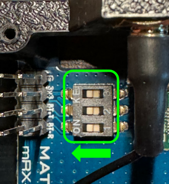
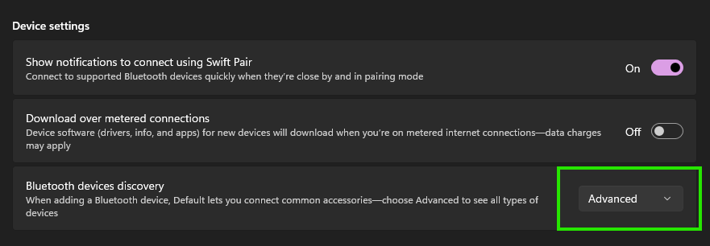

# mLRS Documentation: MatekSys mLRS Tx Modules & Receivers #

([back to main page](../README.md))

The MatekSys mLRS Tx modules and receivers are specifically designed for mLRS and are the best options available. If you are new to mLRS, then it is highy recommended to start with this hardware.

They are available for the 2.4 GHz band and the 868/915 MHz band. 

Note: The MatekSys mLRS gear in the 868/915 MHz band use the newer SX126x/STM32WLE chipset, and are incompatible with SX127x hardware (Frsky R9 system and ELRS 900 MHz gear)(see [here](SX126x_SX127x_INCOMPATIBILITY.md)).

Links to the MatekSys website are found below, which include product specifications, excellent instructions, and more information:

- [Product Page](https://www.mateksys.com/?page_id=12174)

## 2.4 GHz Hardware ##

- [mR24-30 Tx Module Kit](https://www.mateksys.com/?portfolio=mr24-30-tx)
- [mR24-30 Receiver](https://www.mateksys.com/?portfolio=mr24-30)

## 868 MHz  / 915 MHz Hardware ##

- [mR900-30 Tx Module Kit](https://www.mateksys.com/?portfolio=mr900-30-tx)
- [mR900-30 Receiver](https://www.mateksys.com/?portfolio=mr900-30)
- [mR900-22 Receiver](https://www.mateksys.com/?portfolio=mr900-22)

## Flashing / Upgrading Firmware ##

The most convenient way of flashing the mLRS devices is via their USB-C port and using the [mLRS Web Flasher](https://mlrs.xyz/flash) app.

Plug in the USB-C cable while pressing the bind button. This puts the mLRS device into DFU mode (LEDs are not flashing). Then follow the instructions provided by the mLRS Web Flasher app.

## Tx Module | HC-04 Bluetooth Troubleshooting ##

To use the HC-04 Bluetooth module on Matek mLRS Tx modules, no additional configuration should be needed.  mLRS will automatically configure all of the necessary settings on the HC-04 module.  However, if you're having problems you can check the following items:

- Ensure that the 3 dip switches are all in the 'ON' / left position when looking at the Tx module with the antenna pointing up.  You can refer to the photo:
    - 
- If you're using Windows 11 and are unable to see the device being broadcasted, ensure that 'Advanced' is selected within the 'Bluetooth devices discovery' option that is located on the Bluetooth & devices pages.
    - 