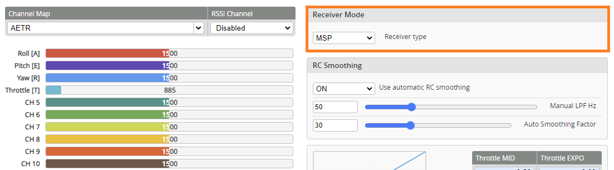

# mLRS Documentation: INAV/MSP Support #

([back to main page](../README.md))

mLRS provides the MspX technology, which is designed to improve the over-the-air communication for systems using the MSP protocol, specifically INAV. It includes the following features:
- MSP to CRSF message conversion which provides telemetry elements to the radio and therefore enables Lua scripts on the radio such as the INAV app to function.
- Robust framing and parsing which reduces packet losses to a minimum, and compression of some very large MSP messages to increase probability of successful transmission.

Note: MspX is tested and verified for INAV 7.1. It has been successfully tested with INAV 8.0 development builds, and should also work with INAV 6.0 and newer (not tested).

## mLRS Receiver Configuration

MspX is enabled by setting the "Rx Ser Link Mode" parameter in the receiver to "mspX".

Further parameter settings:
- "Rx Snd RcChannel": When set to "rc override" or "rc channels", SET_RAW_RC MSP messages are sent to the flight controller. In the flight controller configure the receiver to the MSP protocol. This allows one to avoid the extra wire for CRSF or SBUS.
- "Rx Snd RadioStat": has no effect.

## INAV Configuration

The baudrate should be set to 115200 as lower baudrates have shown irregular telemetry update rates on the radio due to the lack of flow control on the INAV side. 

INAV 8.0 and later will also support a baudrate of 230400 but no change in performance or stability was noticed. Additionally with INAV 8.0 the performance of the serial link to a ground control station (GCS) will be increased, due to some optimizations in INAV. 

To use a mLRS Receiver with INAV in MspX mode, the following settings have to be applied:
- Enable MSP for the Serial Port the mLRS receiver is connected to (UART 2 is recommended on most STM32 flight controllers; do not enable "Serial RX")
- Set the baudrate to 115200 or higher
  

- In the Receiver tab, select the Receiver Type in the Receiver Mode pannel to MSP, and save settings
  

- When connecting INAV 8.0 Configurator through mLRS it is highly recommended to enable the Wireless Mode switch before connection, for better link reliability (do not use Wireless Mode with versions earlier than 8.0, such as INAV 7.1).

If your radio is connected, you should now be able to see the channel values update when you move the radio sticks. No further settings are needed and telemetry will work for OpenTX/EdgeTX radios after scanning for sensors.