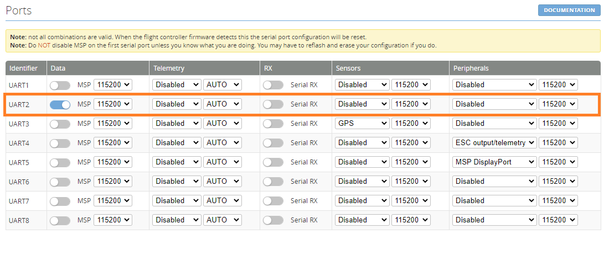
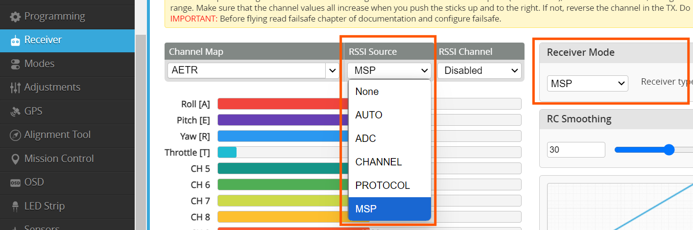
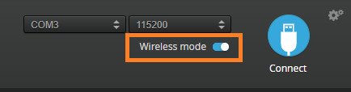

# mLRS Documentation: INAV/MSP Support #

([back to main page](../README.md))

mLRS provides the MspX technology, which is designed to improve the over-the-air communication for systems using the MSP protocol, specifically INAV. It includes the following features:
- MSP to CRSF message conversion which provides telemetry elements to the radio and therefore enables Lua scripts on the radio such as the INAV Telemetry Widget, FM2M Toolbox or the Horus Mapping Widget to function.
- Robust framing and parsing which reduces packet losses to a minimum, and compression of some very large MSP messages to increase probability of successful transmission.
- Provides comprehensive link statistics to the flight controller, enabling them to be shown on the OSD and recorded in the blackbox.
- Possible to have both RC and MSP serial data on a single UART. 

***Notes***: 
- For INAV 7.1 and earlier, MspX does not fully comply with MSP functional design rules and might not work properly with GCS applications. This includes e.g. MWPTools. In these cases, mLRS can be set into transparent mode by setting "Rx Ser Link Mode" = "transp." (the below features of MspX will then not be avaiable).
- It is highly recommended to use INAV 8 or later, although MspX has also been tested with INAV 7.1.
- INAV Configurator is assumed as ground control station, and INAV Lua app on the radio.
- Link statistics and information such as RSSI, LQ, SNR, etc. are provided to the FC only on INAV 8.0 and higher. More info can be found [here](https://github.com/iNavFlight/inav/pull/10451).
- RC Rate will be limited to 37Hz in 2.4GHz FLRC mode (see INAV 8 Summary).

## mLRS Receiver Configuration

#### MspX

MspX is enabled by this setting in the receiver:

- "Rx Ser Link Mode" = "mspX"
- "Ser Baudrate" = "115200" or "230400" (for INAV 8 and later)

#### MSP-RC

For enabling MSP-RC set:

- "Rx Snd RcChannel" = "rc override" or "rc channels" (both have the same functionality in MspX mode)

***Notes***:
- RC link statistics are only sent to the flight controller via MSP if "rc override" or "rc channels" is selected. 
- MSP-RC messages will always override other RC Link inputs. If CRSF is connected and CRSF selected as the RC Protocol in INAV, MSP-RC still has priority if enabled in mLRS and connected to a MSP Enabled UART.

## INAV Configuration

To use a mLRS receiver with INAV in MspX mode, the following settings have to be applied in INAV:
- Enable MSP for the Serial Port the mLRS receiver is connected to (UART 2 is recommended on most STM32 flight controllers; do not enable "Serial RX").
- Set the baudrate to 115200 or higher for consistent dataflow and RC control. Baudrates of less than 57600 can cause message loss on the INAV side and result in inconsistent RC control over MSP-RC (INAV Limitation).
- INAV 8 and later will also support a baudrate of 230400 but no change in performance or stability was noticed.
  

- In the Receiver tab, change the Receiver Mode to 'MSP' and the RSSI Source to 'MSP' (INAV 8 and later) then save settings.
  

- When connecting INAV 8 Configurator through mLRS for flight monitoring, it is recommended to enable the Wireless Mode switch before connection, for better link reliability (do not use Wireless Mode with versions less than 8).

If your radio is connected, you should now be able to see the channel values update when you move the radio sticks. No further settings are needed and telemetry will work for EdgeTX/OpenTX radios after scanning for sensors.

## Differences between INAV 8 and 7 when using MspX

Depending on the chosen connection and serial mode, the functionality will slightly differ, especially in INAV versions before 8. This is a quick overview, what options are available and what functions to expect. 

### INAV 8

Serial Mode:
- MspX
  - provides telemetry sensors to your radio
  - allows RC Control over MSP (rc override)
  - Full MSP GCS Functionality with INAV Configurator, MWP and other applications
  - comprehensive OSD and Blackbox Link Statistics with dedicated MSP messages provided by mLRS
  - limited to 50Hz RC Rate (only relevant for 2.4GHz FLRC mode, which will be limited to 37Hz RC rate, but full datarate)
- Transparent
  - Not recommended
  - See INAV 7 section

RC Out Mode (can be combined with serial if the receiver has 2 UARTs)
- CRSF
  - allows RC Control
  - provides limited link statistics for OSD and Blackbox
  - RC Rate up to 111Hz in 2.4GHz FLRC mode
  - no downlink telemetry

 ***Recommendation***
 
Since INAV 8 in combination with mLRS can provide all features over MspX, it is recommended to only use a single UART MspX connection for most vehicles. The only exception is the 2.4GHz FLRC mode that can provide 111Hz packet and RC rate. 
Due to a performance limitation in INAV, this mode had to be limited to 37Hz RC Rate over MSP. Use a separate CRSF UART instead, to achieve full 111Hz RC Update Rates in this mode. All other features will work as normal. 

### INAV 7

Serial Mode: 
- MspX
  - provides telemetry sensors to your radio
  - allows RC Control over MSP (rc override)
  - Ground control station use is limited to applications that can handle unrequested MSP messages (MWPTools only works in Monitor-Mode, INAV Configurator will be slow to load parameters, etc.)
  - Will not provide RC Link Statistics for OSD or Blackbox
  - limited to 50Hz RC Rate (Only relevant for 2.4GHz FLRC Mode with 111Hz Packet rate, Will be limited to 37Hz RC rate)
- Transparent
  - Full functionality of GCS Software but possibility of higher message loss (Especially big MSP Messages like ADS-B Data or Waypoint Mission transfers)
  - No RC control, no telemetry to the radio (needs CRSF for RC control) 
  - No link statistics for the OSD (Needs CRSF for OSD Link Information)

RC Out Mode (Can be combined with Serial if the Rx has 2 UART)
- CRSF
  - allows RC Control
  - provides limited link statistics for OSD and Blackbox
  - RC Rate up to 111Hz in 2.4GHz FLRC mode
  - no downlink telemetry

 ***Recommendation*** 
 
 For INAV 7 we recommend one of three options, depending on the usecase. 
 1. MspX+CRSF if you fly FPV, the separate CRSF for RC Control enables OSD Link Statistics.
 2. MspX+MSP-RC if no OSD link statistics are needed (autonomous flights and LOS only) and if you use a GCS Software that can handle passive MSP Message Monitoring with no 2-way communication (MWP)
 3. Transparent+CRSF for full 2-Way GCS Communication and RC Control. However, in this case you will not have telemetry on your radio.

