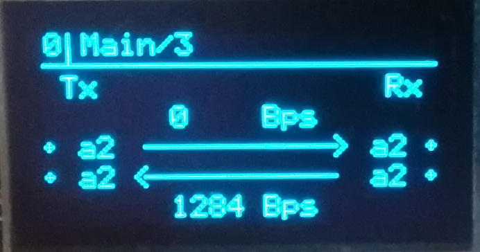

# mLRS Documentation: OLED Display #

([back to main page](../README.md))

mLRS allows for an OLED display to be connected to a Tx module (128x64, SSD1306 using I2C). When paired with a 5-way joystick (4 directions + select) this allows for one to update parameters and display link statistics. The OLED is particularly useful on radios that do not have a color screen and cannot utilize the color Lua script.

## OLED Screens & Navigation

From the main screen, you can navigate through the 4 main screens using the up and down directions. These contain the following information:

<table border="1">
    <tr>
        <th>Main</th>
        <th>Main/2</th>
        <th>Main/3</th>
        <th>Main/4</th>
    </tr>
    <tr>
        <td>Config ID</td>
        <td>Config ID</td>
        <td>Config ID</td>
        <td>Config ID</td>
    </tr>
    <tr>
        <td>Mode</td>
        <td>Mode</td>
        <td>Tx, Rx data rate</td>
        <td>Tx, Rx hardware</td>
    </tr>
    <tr>
        <td>Tx, Rx output power</td>
        <td>Sensitivity</td>
        <td>Tx, Rx active antenna</td>
        <td>Tx, Rx firmware version</td>
    </tr>
    <tr>
        <td>Tx, Rx Rssi</td>
        <td>Tx, Rx output power</td>
        <td></td>
        <td></td>
    </tr>
    <tr>
        <td>Tx, Rx LQ</td>
        <td>Tx, Rx diversity mode</td>
        <td></td>
        <td></td>
    </tr>
    <tr>
        <td></td>
        <td></td>
        <td></td>
        <td></td>
    </tr>
</table>

From the main screen, you can navigate through the setting and action screens using the right and left directions. These contain the following settings:

<table border="1">
    <tr>
        <th>Common</th>
        <th>Tx</th>
        <th>Rx</th>
        <th>Actions</th>
    </tr>
    <tr>
        <td>Config ID</td>
        <td>Config ID</td>
        <td>Config ID</td>
        <td>Config ID</td>
    </tr>
    <tr>
        <td>Bind Phrase</td>
        <td>Power</td>
        <td>Power</td>
        <td>Store</td>
    </tr>
    <tr>
        <td>Mode</td>
        <td>Diversity</td>
        <td>Diversity</td>
        <td>Bind</td>
    </tr>
    <tr>
        <td>Band</td>
        <td>Ch Source</td>
        <td>Ch Order</td>
        <td>Boot</td>
    </tr>
    <tr>
        <td>2.4 Channel Exclusion</td>
        <td>Ch Order</td>
        <td>Out Mode</td>
        <td>FLASH ESP</td>
    </tr>
    <tr>
        <td></td>
        <td>In Mode</td>
        <td>Failsafe Mode</td>
        <td></td>
    </tr>
        <tr>
        <td></td>
        <td>Ser Dest</td>
        <td>Ser Port</td>
        <td></td>
    </tr>
        <tr>
        <td></td>
        <td>Ser Baudrate</td>
        <td>Ser Baudrate</td>
        <td></td>
    </tr>
        <tr>
        <td></td>
        <td>Snd RadioStat</td>
        <td>Ser Link Mode</td>
        <td></td>
    </tr>
        <tr>
        <td></td>
        <td>Mav Component</td>
        <td>Mav System ID</td>
        <td></td>
    </tr>
        <tr>
        <td></td>
        <td>Power Sw Ch</td>
        <td>Snd RadioStat</td>
        <td></td>
    </tr>
    </tr>
        <tr>
        <td></td>
        <td>Buzzer</td>
        <td>Snd RcChannel</td>
        <td></td>
    </tr>
     </tr>
        <tr>
        <td></td>
        <td>Wifi Protocol</td>
        <td>Out Rssi Ch</td>
        <td></td>
    </tr>
        </tr>
        <tr>
        <td></td>
        <td>Wifi Channel</td>
        <td>Out LQ Ch</td>
        <td></td>
    </tr>
        </tr>
        <tr>
        <td></td>
        <td>Wifi Power</td>
        <td>Power Sw Ch</td>
        <td></td>
    </tr>
        </tr>
        <tr>
        <td></td>
        <td></td>
        <td>FS Ch1-16</td>
        <td></td>
    </tr>
    <tr>
        <td></td>
        <td></td>
        <td></td>
        <td></td>
    </tr>
</table>