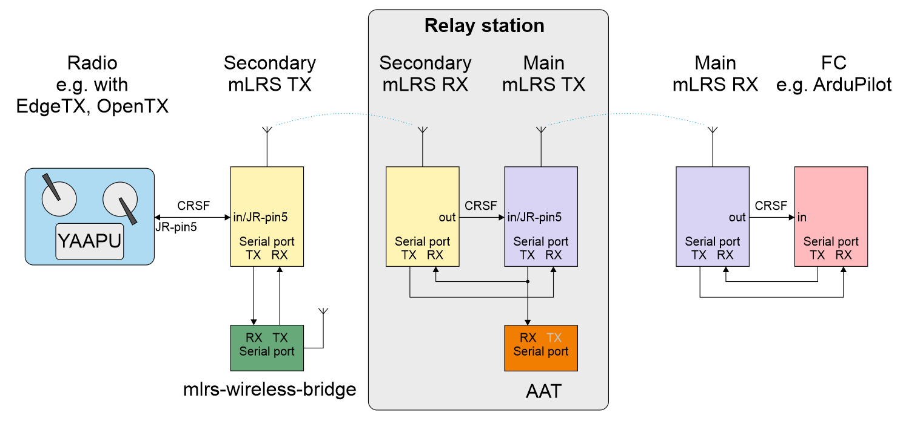
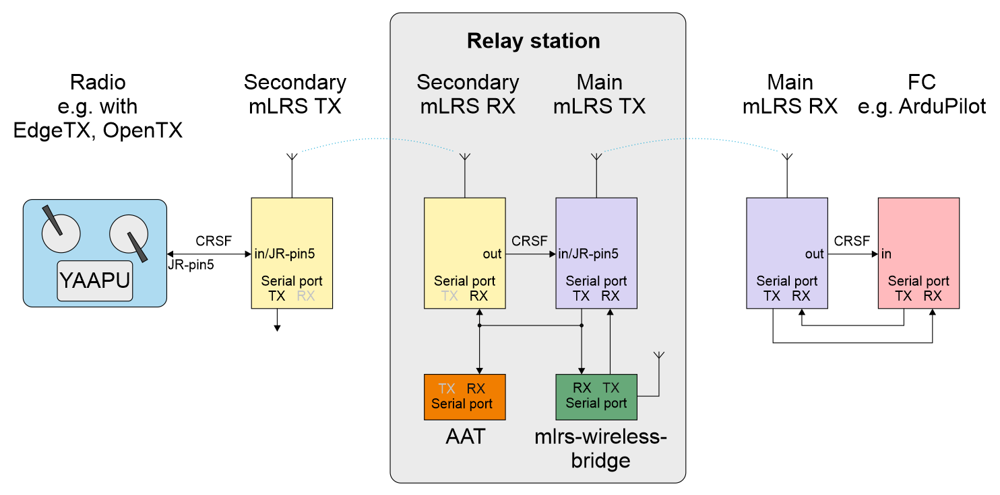

# mLRS Documentation: Relay #

([back to main page](../README.md))

**Important: Relay functionality is experimental and currently only available in the branch 'dev-relay', pre-compiled binaries can be found in the firmware folder ([here](https://github.com/olliw42/mLRS/tree/dev-relay/firmware)).**

mLRS allows for a relay setup in which a main Tx, Rx pair is used with a secondary Tx, Rx pair to offer flexibility when locating the main Tx module. The relay setup will forward the RC channels from the radio to the flight controller while also sending the link statistics and CRSF sensors of the main Tx, Rx pair back to the radio. A relay setup is beneficial by allowing you to place the main Tx module on your antenna tracker while still being able to control the vehicle from the radio.

For a relay setup is recommended to:
- Use a lower RF frequency which is better suited for long range for the main Tx, Rx pair
- Use different RF bands for the main and secondary Tx, Rx pairs to avoid interference
    - If using the same RF band, then different bind phrases need to be used for the pairs
- Use a faster mode for the secondary Tx, Rx pair

Note: Not all receiver hardware will be able to function as a secondary Rx in a relay setup. For example, STM32F1 based hardware is currently not supported.

## Configuring the Main Tx, Rx pair

Assuming you've already completed the setup following the [CRSF page](../docs/CRSF.md), there is no additional configuration needed for the main Tx, Rx pair. However, note that any configuration of the main pair will have to be done by either the CLI or OLED when the main Tx module isn't wired to the radio. The Lua script can only be used to configure a pair whose Tx module is wired to a radio.

## Configuring the Secondary Tx, Rx pair

Assuming you've already completed the setup following the [CRSF page](../docs/CRSF.md), to enable the secondary Tx, Rx pair to act as a relay the following parameter needs to be set:

- Rx Out Mode = crsf tx

Further, certain settings will need to be configured properly in order for the relay functionality to work, these are:

- "Rx Ch Order" and "Tx Ch Order" of the secondary pair need to match
- "Rx Ser Baudrate" of the secondary Rx has to match "Tx Ser Baudrate" of the primary Tx
- "Rx Ser Link Mode" has to be the same for both pairs, either "mavlink" or "mavlinkx"

## Diagrams

Here are two example options showing relay setups:

Example #1, wireless bridge connected to the secondary Tx:

Example #2, wireless bridge connected to the main Tx:

