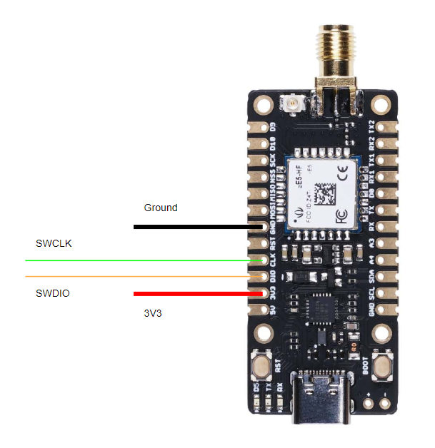
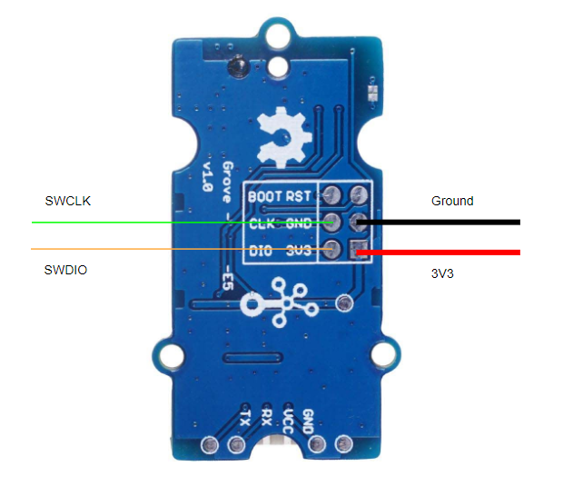

# mLRS Documentation: SeeedStudio Wio-E5 Boards #

([back to main page](../README.md))

Note: 868/915 MHz E5 hardware cannot connect with 868/915 MHz mLRS hardware using the SX127x LoRa chipset (ELRS, R9). This is because the 868/915 MHz E5 hardware uses the SX126x LoRa chipset, which is incompatible with the SX127x LoRa chipset for the spreading factor used by the mLRS 19 Hz mode. In addition, the SX127x does not support the spreading factor which is used for the mLRS 31 Hz mode.

The SeeedStudio [Wio-E5 module](https://wiki.seeedstudio.com/LoRa-E5_STM32WLE5JC_Module) is a highly attractive module for building mLRS equipment. SeeedStudio provides a number of boards which are based on this module, and which are quite interesting hardware for mLRS. However, these boards are not perfect since their pins are not ready-made for the purposes of mLRS. So, some tweaking and (easy) soldering is required.

<table>
  <tbody>
    <tr>
      <td>Frequency Bands</td>
      <td>868 MHz/915 MHz</td>
    </tr>
    <tr>
      <td>Max. RF Output Power</td>
      <td>22 dBm (158 mW)</td>
    </tr>
    <tr>
      <td>Supported Modes</td>
      <td>31 Hz, 19 Hz</td>
    </tr>
    <tr>
      <td>LoRa Chipset</td>
      <td>SX126x</td>
    </tr>
    <tr>
      <td>Compatibility</td>
      <td>Compatible with EBYTE E77 MBL, E77 Easy Solder.  Incompatible with SX127x hardware (Frsky R9 and ELRS).</td>
    </tr>
    <tr>
      <td>Weight</td>
      <td>Wio-E5 Mini: ~7 grams without antenna</td>
    </tr>
  </tbody>
</table>

## SeeedStudio Wio-E5 Mini dev Board ##

- [Product Page](https://wiki.seeedstudio.com/LoRa_E5_mini/)
- [3D Model](https://www.thingiverse.com/thing:6108814)

This board is well suited for building a Tx mLRS module, and - if the somewhat larger weight and size is no concern - also for building a receiver.

### As Tx Module ###

Connections (name in respect to board print-ons):

- serial: Tx2,Rx2
- in: Rx1
- com/cli: Tx,Rx and on-board USB plug
- debug: A3
- led green: none (see note below)
- led red: on-board
- bind button: BOOT button, hold for 4 seconds to initiate bind mode

Example Wiring using JR bay with CRSF:

*The Schottky diode between the TX1 and RX1 pins is not needed with the default firmware. If you are having communication issues between the radio and the Tx module then you can install the Schottky diode and use the 'sdiode' firmware ('sdiode' will be included in the file name, e.g. tx-Wio-E5-Mini-wle5jc-**sdiode**-vX.X.XX.hex).

**The green LED and resistor is optional. It can be enabled with a custom firmware build by removing #define DEVICE_HAS_SINGLE_LED in the hal.  

### As Receiver ###

Connections (name in respect to board print-ons):

- serial: Tx2,Rx2
- out: Tx1
- debug: Tx, and on-board USB plug
- led green: none (see note below)
- led red: on-board
- bind button: BOOT button, hold for 4 seconds to initiate bind mode

Example Wiring:

*The green LED and resistor is optional. It can be enabled with a custom firmware build by removing #define DEVICE_HAS_SINGLE_LED in the hal.

## SeeedStudio Grove Wio-E5 Board ##

- [Product Page](https://wiki.seeedstudio.com/Grove_LoRa_E5_New_Version/)
- [Printable Cases](https://www.printables.com/model/535202-wio-e5-grove-case)

### As Tx Module ###

Not recommended.

### As Receiver ###

Connections (name in respect to board print-ons):

- serial: Tx,Rx on connector, and solder pads on bottom
- out: none
- debug: none
- led green: none
- led red: on-board (solder jumper on the bottom of the board needs to be closed)
- bind button: BOOT solder pad (solder a button between the BOOT pad and GND or a wire between the two to ground out the BOOT pad, hold for 4 seconds to initiate bind mode)

Example Wiring:

## Flashing the Modules ##

**Important: Every time that you power a board you should ensure that there is an antenna connected otherwise you risk damaging the RF section.**

### Initial Flashing ###

The first time that you flash the mLRS firmware to either the Wio-E5 Mini or Wio-E5 Grove you'll have to do the following:

- Download and install [STM32CubeProgrammer](https://www.st.com/en/development-tools/stm32cubeprog.html)
- Connect your ST-Link programmer to the 3V3, GND, SWD, and SWCLK pins on the board (images below)
    - The SWD and SWCLK pins are labeled 'DIO' and 'CLK' respectively
    - Some ST-Link programmers provide power and some do not - ensure the Wio-E5 is powered
- Hold down the boot button and then press the reset button, boot button can then be released
    - For Wio-E5 Grove you'll need to connect the boot pad to ground while powering up
- Launch STM32CubeProgrammer and select ST-Link as the connection method, click connect
- From the menu on the left select the OB (Option Bytes) tile
- From the Read Out Protection section, change to AA, select Apply
    - This will erase the factory firmware
- From the menu on the left select the Download tile
- Select the correct firmware in the Download section, click Start Program
- Power cycle the board, the red LED should blink which indicates that the board is disconnected

  
   

### Subsequent Flashing ###

Subsequent flashing can be done in two ways:
1. Follow the initial flashing process using the ST-Link programmer
    - There is no need to change the read out protection after the initial flash
    - If a full erase is desired, go to the Erase & Programming page and click 'Full chip erase'
2. Boot into the system bootloader using the CLI, Lua script or the OLED display
    - This enables programming over UART1 (pins PA9 | Tx, PA10 | Rx, labeled 'D9' and 'MOSI' respectively) or UART2 (pins PA2 | Tx, PA3 | Rx, labeled 'Tx2' and 'Rx2' respectively) with a USB-TTL adapter at 115200 baud using the serial connection option in STM32CubeProgrammer. Unfortunately, the on-board USB connector cannot be used for flashing.
