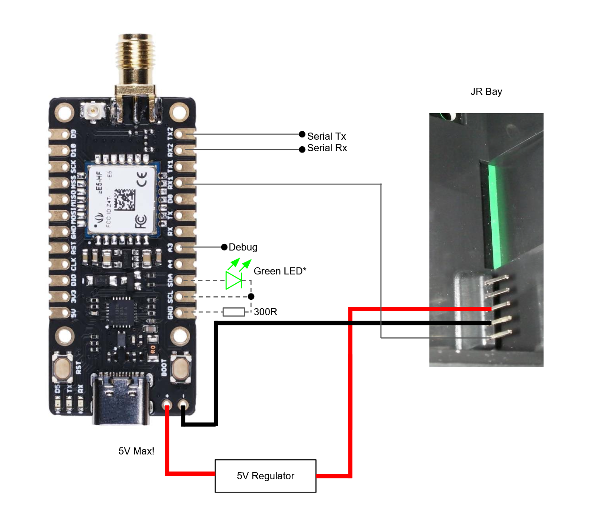

# mLRS Documentation: SeeedStudio Wio-E5 Boards #

([back to main page](../README.md))

The SeeedStudio [Wio-E5 module](https://wiki.seeedstudio.com/LoRa-E5_STM32WLE5JC_Module) is a highly attractive module for building mLRS equipment. SeeedStudio provides a number of boards which are based on this module, and which are quite interesting hardware for mLRS. However, these boards are not perfect since their pins are not ready-made for the purposes of mLRS. So, some tweaking and (easy) soldering is required.

## Flashing the Modules ##

Important - every time that you power a board you should ensure that there is an antenna connected otherwise you risk damaging the RF section.

### Initial Flashing ###

The first time that you flash the mLRS firmware to either the E5 Mini or E5 Grove you'll have to do the following:

- Download and install [STM32CubeProgrammer](https://www.st.com/en/development-tools/stm32cubeprog.html)
- Connect your ST-Link to the 3V3, GND, SWD, and SWCLK pins on the board
    - The SWD and SWCLK pins are labeled 'DIO' and 'CLK' respectively
    - Some ST-Link boards provide power and some do not - ensure the E5 is powered
- Launch STM32CubeProgrammer and select ST-Link as the connection method, click connect
- From the menu on the left select the OB (Option Bytes) tile
- From the Read Out Protection section, change to AA, select Apply
    - This will erase the factory firmware
- From the menu on the left select the Download tile
- Select the correct firmware in the Download section, click Start Program
- Power cycle the board, the red LED should blink which indicates that the board is disconnected

### Subsequent Flashing ###

Subsequent flashing can be done in two ways:
1. Follow the initial flashing process
    - There is no need to change the read out protection after the initial flash
2. Boot into the system bootloader using the cli (or Lua)
    - This enables programming over UART1 (PA9, PA10) or UART2 (PA2, PA3) with a USB<>UART adapter using the Serial connection option in STM32CubeProgrammer

## SeeedStudio Wio-E5 mini dev Board as Tx Module ##

https://wiki.seeedstudio.com/LoRa_E5_mini/

### As Tx Module ###

Connections (name in respect to board print-ons):

- serial: Tx2,Rx2
- in: Rx1
- com/cli: Tx,Rx and on-board USB plug
- debug: A3
- led green: SDA (solder a green LED with resistor > 300 Ohm to GND, you can use pad SCL as intermediate post)
- led red: on-board
- button: on-board (BOOT button)

If you want to communicate with the radio via the JR bay (pin 5 in the JR bay), then you in addition need to do:

- solder a Schottky diode (e.g. BAT42) between pads RX1 and TX1 (RX1 - |<| - TX1, |<| represents the diode)
- use firmware with DEVICE_HAS_JRPIN5 enabled (this is the default)

Example Wiring using JR bay with CRSF:

### As Rx Module ###

Connections (name in respect to board print-ons):

- serial: Tx2,Rx2
- out: Tx1
- debug: Tx, and on-board USB plug
- led green: SDA (solder a green LED with resistor > 300 Ohm to GND, you can use pad SCL as intermediate post)
- led red: on-board
- button: on-board (BOOT button)

Example Wiring:

## SeeedStudio Grove Wio-E5 Board as Rx Module ##

https://wiki.seeedstudio.com/Grove_LoRa_E5_New_Version/

### As Tx Module ###

not recommended

### As Rx Module ###

Connections (name in respect to board print-ons):

- serial: Tx,Rx on connector, and solder pads on bottom
- out: none
- debug: none
- led green: none
- led red: on-board (solder jumper on the bottom of the board needs to be closed)
- button: BOOT solder pad (solder a button between the BOOT pad and GND)

Note: There is no convenient way to connect a green LED, and you thus won't get the information conveyed by it (like connection). It is possible to work around this but it would require some more sophisticated solder work.

Example Wiring:

