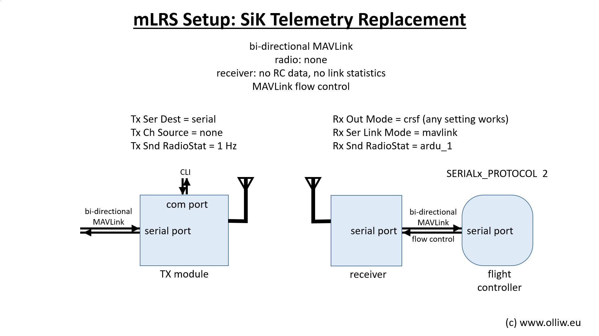

# mLRS Documentation: Setup as SiK Telemetry Replacement #

([back to main page](../README.md))

This page describes how to use mLRS as a bi-directional MAVLink telemetry link similar to a SiK telemetry unit. This setup doesn't require a radio and will only transmit and receive MAVLink data.

## Setup

The configuration for this mode is similar to others, except that one can ignore the RC settings on both the mLRS Tx module and receiver. The RC input and output pins on the devices are not used.

For this setup, the mLRS Tx module should having the following settings:
- Tx Ch Source = none
- Tx Snd RadioStat = 1 Hz

> [!NOTE]
> "Tx Snd RadioStat" = "1 Hz" sends the RSSI of the Tx module to the ground station software.

There is no specific configuration of the mLRS receiver neccessary. 

Further configuration should follow the settings described within the [CRSF Telemetry and Yaapu Telemetry App](CRSF.md) page. If you are using a separate RC system (e.g. Crossfire, ELRS, FrSky, etc.), the sub chapter [Setup ArduPilot: CRSF receiver](CRSF.md/#crsf-receiver) will need to be modified for the system you are using, otherwise it can be ignored.