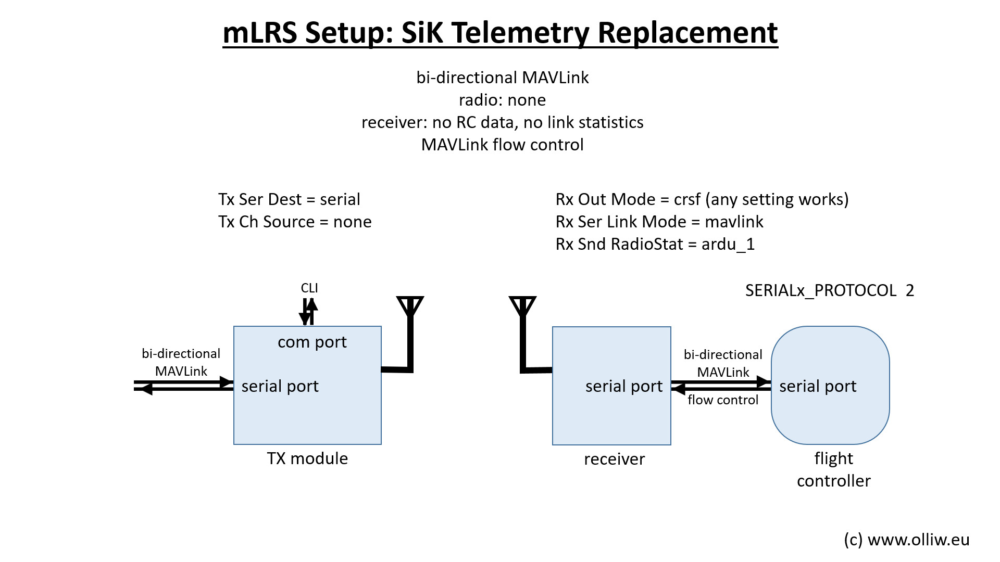

# mLRS Documentation: Setup as SiK Telemetry Replacement #

([back to main page](../README.md))

This page describes how to set up an mLRS system to work as a bi-directional serial MAVLink telemetry link, independent on any radio, where mLRS' rc data capability is not desired and mLRS should only transmits and receives serial MAVLink data. This setup finds application in situations where traditionally, e.g., SiK telemetry uints would be used.

## Setup

The configuration for this mode of operation just follows that for any other configuration, except that one simply ignores the rc data input on the mLRS Tx module and the rc data output on the mLRS receiver.

For this setup, the mLRS Tx module should be set to "Tx Ch Soure = none". 

There is no specific configuration of the mLRS receiver neccessary. 

Except of "Tx Ch Soure = none", the configuration can exactly follow the settings described in [CRSF Telemetry and Yaapu Telemetry App](CRSF.md), with the obvious modification, that settings related to the RC data are ignored. For instance, the sub chapter [Setup ArduPilot: CRSF receiver](CRSF.md/#crsf-receiver) is to be substituted by the setup required for the used RC system. 

The settings in these sub chapters can be applied directly: [ArduPilot Setup: MAVLink Serial Port](CRSF.md/#mavlink-serial-port), [ArduPilot Setup: Stream Rates](CRSF.md/#stream-rates) and [mLRS Rx Module Setup](CRSF.md/#mlrs-rx-module-setup).

