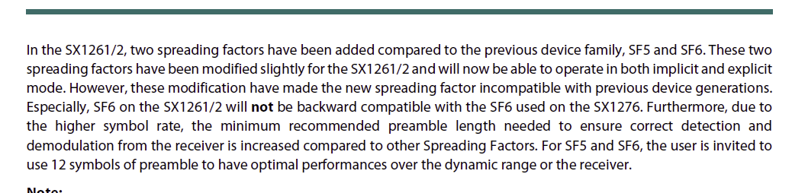

# mLRS Documentation: SX126x and SX127x Incompatibility #

([back to main page](../README.md))

mLRS hardware using the SX126x/STM32WLE and SX127x LoRa chipsets are ***not*** compatible with each other and will not bind.

This is for two reasons:
- The 31 Hz mode uses spreading factor 5 (SF5), which is only available on the SX126x/STM32WLE chipset.
- The 19 Hz mode uses spreading factor 6 (SF6), which was modified on the SX126x/STM32WLE chipset making it incompatible with the SX127x chipset.

This is the relevant part in the datasheet of the SX126x chipset:

