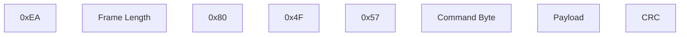

## __0x81, 0x82 mLRS reserved__

The 0x80 and 0x81 frames establish the communcication of mLRS TX modules with mLRS Configuration Lua scripts running on e.g. EdgeTx and OpenTx remote controllers. They encapsulate mLRS 'mBridge' protocol messages in CRSF frames. The protocol enables the setting of parameters, but especially also communicates meta data which are needed for mLRS' parameter model, providing various information to the user, version control, and more features specific to the mLRS link system.

**0x80**: Communication from Lua script/remote controller to TX module. The frame format is:



**0x81**: Communication from TX module to Lua script/remote controller. The frame format is:

```mermaid
flowchart LR
    0xEE ~~~ Frame Length ~~~ 0x81 ~~~ Command Byte ~~~ Payload ~~~ CRC
```

The mBridge protocol is relatively complicated, as it serves mLRS for various additional purposes besides communication with the Lua configuration script. 

mLRS project home: https://github.com/olliw42/mLRS/